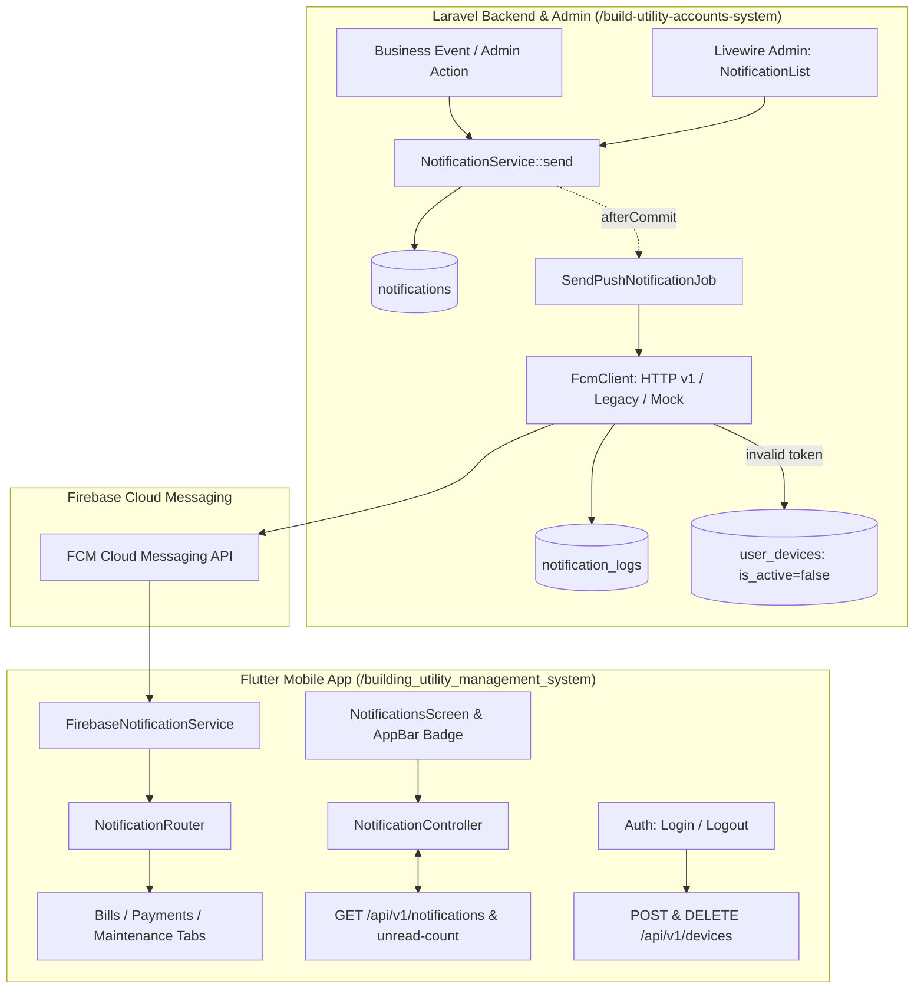

# Centralized API-Based Push Notification System Implementation Plan

> **For agentic workers:** REQUIRED SUB-SKILL: Use superpowers:subagent-driven-development to implement this plan task-by-task. Steps use checkbox (`- [ ]`) syntax for tracking.

**Goal:** Implement a centralized, production-ready, API-based push notification system with multi-device tracking, database notification center, queue-backed FCM delivery, Web Admin management, and Flutter Clean Architecture/GetX mobile integration.

**Architecture:** The Laravel backend acts as the source of truth, persisting every notification in a `notifications` table, enforcing idempotency via `notification_key`, and dispatching `SendPushNotificationJob` to the queue after database transaction commit. The dual-mode `FcmClient` pushes to active user devices in `user_devices` via FCM HTTP v1 or legacy key with dead token deactivation and audit logs. The Flutter mobile app (`building_utility_management_system`) registers devices on login, unregisters on logout, displays foreground heads-up alerts, updates reactive unread badges, deep links taps via `NotificationRouter`, and renders the in-app Notification Center.

**Architecture Diagram:**



**Tech Stack:**
- Laravel 13, PHP 8.5, PostgreSQL, Livewire 4, Spatie Permission
- Flutter 3.24+ / 3.44.6, Dart 3.12+, GetX 4.6.6, Dio 5.4+, Firebase Messaging, Flutter Local Notifications

## Global Constraints

- Never rewrite or break existing accounting, ledger, or billing business logic.
- Never hardcode Firebase credentials or tokens; read strictly from environment configuration (`.env`).
- Never trust client-supplied `user_id` for ownership; always extract from authenticated Sanctum session.
- Database transactions must commit before queuing FCM delivery (`afterCommit`).
- Single physical device (`device_id`) can transfer ownership safely on re-login, deactivating on logout.
- Code style: run `vendor/bin/pint --dirty --format agent` on modified PHP files; run `flutter analyze` on Dart files.

---

### Task 1: Database Migrations & Eloquent Models (`user_devices`, `notifications`, `notification_logs`)

**Files:**
- Create: `database/migrations/2026_09_12_000001_create_user_devices_table.php`
- Create: `database/migrations/2026_09_12_000002_create_notifications_table.php`
- Create: `database/migrations/2026_09_12_000003_create_notification_logs_table.php`
- Create: `app/Models/UserDevice.php`
- Create: `app/Models/Notification.php`
- Create: `app/Models/NotificationLog.php`
- Create: `database/factories/UserDeviceFactory.php`
- Create: `database/factories/NotificationFactory.php`
- Modify: `app/Models/User.php`
- Test: `tests/Feature/Notification/ModelsAndMigrationTest.php`

**Interfaces:**
- Produces: `UserDevice` model (`user_id`, `device_id`, `device_token`, `platform`, `device_model`, `os_version`, `app_version`, `is_active`, `last_seen_at`)
- Produces: `Notification` model (`user_id`, `type`, `title`, `body`, `data`, `reference_type`, `reference_id`, `notification_key`, `is_read`, `read_at`, `sent_at`, `status`)
- Produces: `NotificationLog` model (`notification_id`, `user_id`, `user_device_id`, `status`, `error_message`, `response_payload`)
- Produces: `User::userDevices()`, `User::notifications()`

- [ ] **Step 1: Write failing feature test for models, factories, and relationships**

```php
// tests/Feature/Notification/ModelsAndMigrationTest.php
namespace Tests\Feature\Notification;

use App\Models\Notification;
use App\Models\NotificationLog;
use App\Models\User;
use App\Models\UserDevice;
use Illuminate\Foundation\Testing\RefreshDatabase;
use Tests\TestCase;

class ModelsAndMigrationTest extends TestCase
{
    use RefreshDatabase;

    public function test_user_can_have_multiple_active_devices(): void
    {
        $user = User::factory()->create();

        $device1 = UserDevice::create([
            'user_id' => $user->id,
            'device_id' => 'device-111',
            'device_token' => 'fcm-token-111',
            'platform' => 'android',
            'device_model' => 'Pixel 9',
            'is_active' => true,
        ]);

        $device2 = UserDevice::create([
            'user_id' => $user->id,
            'device_id' => 'device-222',
            'device_token' => 'fcm-token-222',
            'platform' => 'ios',
            'device_model' => 'iPhone 15',
            'is_active' => true,
        ]);

        $this->assertCount(2, $user->userDevices);
        $this->assertTrue($user->userDevices->first()->is_active);
    }

    public function test_notification_creation_and_logs(): void
    {
        $user = User::factory()->create();

        $notification = Notification::create([
            'user_id' => $user->id,
            'type' => 'BILL_GENERATED',
            'title' => 'New Bill Available',
            'body' => 'Your monthly bill has been generated.',
            'data' => ['screen' => 'bills', 'bill_id' => 42],
            'reference_type' => 'bill',
            'reference_id' => 42,
            'notification_key' => 'BILL_GENERATED:42:USER:'.$user->id,
            'status' => 'pending',
        ]);

        $this->assertFalse($notification->is_read);
        $this->assertEquals('BILL_GENERATED', $notification->type);

        $log = NotificationLog::create([
            'notification_id' => $notification->id,
            'user_id' => $user->id,
            'status' => 'success',
            'response_payload' => ['message_id' => 'fcm_12345'],
        ]);

        $this->assertEquals($notification->id, $log->notification->id);
    }
}
```

- [ ] **Step 2: Run test to verify it fails**

Run: `php artisan test --compact tests/Feature/Notification/ModelsAndMigrationTest.php`  
Expected: FAIL with missing tables or missing classes.

- [ ] **Step 3: Implement migrations, models, and factories**

Create `database/migrations/2026_09_12_000001_create_user_devices_table.php`:
```php
<?php

use Illuminate\Database\Migrations\Migration;
use Illuminate\Database\Schema\Blueprint;
use Illuminate\Support\Facades\Schema;

return new class extends Migration {
    public function up(): void
    {
        Schema::create('user_devices', function (Blueprint $table): void {
            $table->id();
            $table->foreignId('user_id')->constrained()->cascadeOnDelete();
            $table->string('device_id', 191)->unique();
            $table->string('device_token', 500)->index();
            $table->string('platform', 20)->default('android')->index();
            $table->string('device_model', 100)->nullable();
            $table->string('os_version', 50)->nullable();
            $table->string('app_version', 50)->nullable();
            $table->boolean('is_active')->default(true)->index();
            $table->timestamp('last_seen_at')->nullable();
            $table->timestamps();
        });
    }

    public function down(): void
    {
        Schema::dropIfExists('user_devices');
    }
};
```

Create `database/migrations/2026_09_12_000002_create_notifications_table.php`:
```php
<?php

use Illuminate\Database\Migrations\Migration;
use Illuminate\Database\Schema\Blueprint;
use Illuminate\Support\Facades\Schema;

return new class extends Migration {
    public function up(): void
    {
        Schema::create('notifications', function (Blueprint $table): void {
            $table->id();
            $table->foreignId('user_id')->constrained()->cascadeOnDelete();
            $table->string('type', 50)->index();
            $table->string('title', 255);
            $table->text('body');
            $table->jsonb('data')->nullable();
            $table->string('reference_type', 50)->nullable()->index();
            $table->unsignedBigInteger('reference_id')->nullable()->index();
            $table->string('notification_key', 191)->nullable()->unique();
            $table->boolean('is_read')->default(false)->index();
            $table->timestamp('read_at')->nullable();
            $table->timestamp('sent_at')->nullable();
            $table->string('status', 20)->default('pending')->index();
            $table->timestamps();
        });
    }

    public function down(): void
    {
        Schema::dropIfExists('notifications');
    }
};
```

Create `database/migrations/2026_09_12_000003_create_notification_logs_table.php`:
```php
<?php

use Illuminate\Database\Migrations\Migration;
use Illuminate\Database\Schema\Blueprint;
use Illuminate\Support\Facades\Schema;

return new class extends Migration {
    public function up(): void
    {
        Schema::create('notification_logs', function (Blueprint $table): void {
            $table->id();
            $table->foreignId('notification_id')->constrained()->cascadeOnDelete();
            $table->foreignId('user_id')->constrained()->cascadeOnDelete();
            $table->foreignId('user_device_id')->nullable()->constrained('user_devices')->nullOnDelete();
            $table->string('status', 20)->index();
            $table->text('error_message')->nullable();
            $table->jsonb('response_payload')->nullable();
            $table->timestamps();
        });
    }

    public function down(): void
    {
        Schema::dropIfExists('notification_logs');
    }
};
```

Implement `app/Models/UserDevice.php`, `app/Models/Notification.php`, `app/Models/NotificationLog.php`, and update `app/Models/User.php`.

- [ ] **Step 4: Run test to verify it passes**

Run: `php artisan test --compact tests/Feature/Notification/ModelsAndMigrationTest.php`  
Expected: PASS

- [ ] **Step 5: Commit**

```bash
git add database/migrations/ app/Models/ tests/Feature/Notification/ModelsAndMigrationTest.php database/factories/
git commit -m "feat(notification): add user_devices, notifications, and notification_logs tables and models"
```

---

### Task 2: Notification Core Enums, Config & Multi-Mode `FcmClient`

**Files:**
- Create: `app/Enums/NotificationType.php`
- Create: `app/Services/Notification/FcmClient.php`
- Modify: `config/services.php`
- Test: `tests/Unit/Services/FcmClientTest.php`

**Interfaces:**
- Produces: `NotificationType` enum (`BillGenerated`, `PaymentApproved`, `PaymentRejected`, `MaintenanceUpdated`, `NoticePublished`, `AdminNotification`, `SystemBroadcast`)
- Produces: `FcmClient::send(UserDevice $device, string $title, string $body, array $data = []): array` returning `['success' => bool, 'status' => string, 'error' => ?string, 'invalid_token' => bool, 'response' => array]`

- [ ] **Step 1: Write unit test for FcmClient (Mock mode, Legacy mode, and Invalid Token handling)**

```php
// tests/Unit/Services/FcmClientTest.php
namespace Tests\Unit\Services;

use App\Models\User;
use App\Models\UserDevice;
use App\Services\Notification\FcmClient;
use Illuminate\Foundation\Testing\RefreshDatabase;
use Illuminate\Support\Facades\Http;
use Tests\TestCase;

class FcmClientTest extends TestCase
{
    use RefreshDatabase;

    public function test_fcm_client_mock_mode_when_disabled(): void
    {
        config(['services.fcm.enabled' => false]);

        $user = User::factory()->create();
        $device = UserDevice::create([
            'user_id' => $user->id,
            'device_id' => 'dev-mock-1',
            'device_token' => 'fcm-token-mock',
            'platform' => 'android',
        ]);

        $client = new FcmClient();
        $result = $client->send($device, 'Test Title', 'Test Body', ['screen' => 'home']);

        $this->assertTrue($result['success']);
        $this->assertEquals('mock_sent', $result['status']);
    }

    public function test_fcm_client_handles_unregistered_token_by_flagging(): void
    {
        config([
            'services.fcm.enabled' => true,
            'services.fcm.key' => 'legacy-server-key',
        ]);

        Http::fake([
            'https://fcm.googleapis.com/fcm/send' => Http::response([
                'failure' => 1,
                'results' => [['error' => 'NotRegistered']],
            ], 200),
        ]);

        $user = User::factory()->create();
        $device = UserDevice::create([
            'user_id' => $user->id,
            'device_id' => 'dev-unreg-1',
            'device_token' => 'invalid-token',
            'platform' => 'android',
        ]);

        $client = new FcmClient();
        $result = $client->send($device, 'Test', 'Body');

        $this->assertFalse($result['success']);
        $this->assertTrue($result['invalid_token']);
    }
}
```

- [ ] **Step 2: Run test to verify it fails**

Run: `php artisan test --compact tests/Unit/Services/FcmClientTest.php`  
Expected: FAIL with missing class `FcmClient`.

- [ ] **Step 3: Implement `NotificationType` enum, `config/services.php` update, and `FcmClient`**

Modify `config/services.php` to include:
```php
    'fcm' => [
        'enabled' => env('FCM_ENABLED', true),
        'key' => env('FCM_SERVER_KEY'),
        'project_id' => env('FCM_PROJECT_ID'),
        'credentials_path' => env('FIREBASE_CREDENTIALS_PATH'),
        'credentials_json' => env('FIREBASE_CREDENTIALS_JSON'),
    ],
```

Implement `app/Services/Notification/FcmClient.php` supporting HTTP v1 (OAuth2 service account when project_id and credentials are set), legacy FCM HTTP endpoint (`https://fcm.googleapis.com/fcm/send`), and mock mode when disabled/unconfigured.

- [ ] **Step 4: Run test to verify it passes**

Run: `php artisan test --compact tests/Unit/Services/FcmClientTest.php`  
Expected: PASS

- [ ] **Step 5: Commit**

```bash
git add config/services.php app/Enums/ app/Services/Notification/FcmClient.php tests/Unit/Services/FcmClientTest.php
git commit -m "feat(notification): implement NotificationType enum and multi-mode FcmClient"
```

---

### Task 3: Centralized `NotificationService` & `SendPushNotificationJob`

**Files:**
- Create: `app/Services/Notification/NotificationService.php`
- Create: `app/Jobs/SendPushNotificationJob.php`
- Test: `tests/Feature/Notification/NotificationServiceTest.php`

**Interfaces:**
- Consumes: `FcmClient`, `Notification`, `NotificationLog`, `UserDevice`
- Produces: `NotificationService::send(User|Collection|array $recipients, NotificationType $type, string $title, string $body, array $data = [], ?string $referenceType = null, ?int $referenceId = null, ?string $notificationKey = null): Collection`
- Produces: `SendPushNotificationJob` (Queueable, `afterCommit()`)

- [ ] **Step 1: Write feature test for NotificationService and Queue Job**

```php
// tests/Feature/Notification/NotificationServiceTest.php
namespace Tests\Feature\Notification;

use App\Enums\NotificationType;
use App\Jobs\SendPushNotificationJob;
use App\Models\Notification;
use App\Models\User;
use App\Models\UserDevice;
use App\Services\Notification\NotificationService;
use Illuminate\Foundation\Testing\RefreshDatabase;
use Illuminate\Support\Facades\Queue;
use Tests\TestCase;

class NotificationServiceTest extends TestCase
{
    use RefreshDatabase;

    public function test_send_creates_notification_and_dispatches_job(): void
    {
        Queue::fake();

        $user = User::factory()->create();
        $service = app(NotificationService::class);

        $notifications = $service->send(
            recipients: $user,
            type: NotificationType::BillGenerated,
            title: 'Bill Ready',
            body: 'Your bill for September is generated.',
            data: ['screen' => 'bills', 'bill_id' => 10],
            referenceType: 'bill',
            referenceId: 10,
            notificationKey: 'BILL:10:USER:'.$user->id,
        );

        $this->assertCount(1, $notifications);
        $this->assertDatabaseHas('notifications', [
            'user_id' => $user->id,
            'type' => NotificationType::BillGenerated->value,
            'title' => 'Bill Ready',
            'notification_key' => 'BILL:10:USER:'.$user->id,
        ]);

        Queue::assertPushed(SendPushNotificationJob::class);
    }

    public function test_send_respects_idempotency_key(): void
    {
        Queue::fake();

        $user = User::factory()->create();
        $service = app(NotificationService::class);

        $service->send(
            recipients: $user,
            type: NotificationType::BillGenerated,
            title: 'Bill Ready',
            body: 'First call',
            notificationKey: 'IDEMPOTENT_KEY_123',
        );

        $service->send(
            recipients: $user,
            type: NotificationType::BillGenerated,
            title: 'Bill Ready Duplicate',
            body: 'Second call',
            notificationKey: 'IDEMPOTENT_KEY_123',
        );

        $this->assertEquals(1, Notification::where('notification_key', 'IDEMPOTENT_KEY_123')->count());
        Queue::assertPushed(SendPushNotificationJob::class, 1);
    }
}
```

- [ ] **Step 2: Run test to verify it fails**

Run: `php artisan test --compact tests/Feature/Notification/NotificationServiceTest.php`  
Expected: FAIL with missing `NotificationService`.

- [ ] **Step 3: Implement `NotificationService` and `SendPushNotificationJob`**

Implement `NotificationService` to create `Notification` records, enforce idempotency, and dispatch `SendPushNotificationJob` with `->afterCommit()`.
Implement `SendPushNotificationJob` to load active devices, invoke `FcmClient`, deactivate devices with invalid tokens, and record `NotificationLog` entries.

- [ ] **Step 4: Run test to verify it passes**

Run: `php artisan test --compact tests/Feature/Notification/NotificationServiceTest.php`  
Expected: PASS

- [ ] **Step 5: Commit**

```bash
git add app/Services/Notification/NotificationService.php app/Jobs/SendPushNotificationJob.php tests/Feature/Notification/NotificationServiceTest.php
git commit -m "feat(notification): implement NotificationService and SendPushNotificationJob"
```

---

### Task 4: Device Registration & Management REST APIs

**Files:**
- Create: `app/Http/Controllers/Api/V1/DeviceApiController.php`
- Modify: `app/Http/Controllers/Api/V1/AuthController.php:109-125`
- Modify: `routes/api.php`
- Test: `tests/Feature/Api/V1/DeviceApiTest.php`

**Interfaces:**
- Produces: `POST /api/v1/devices/register`
- Produces: `DELETE /api/v1/devices/{device_id}`
- Modifies: `POST /api/v1/auth/fcm-token` (proxies to register device for backward compatibility)

- [ ] **Step 1: Write feature test for device registration, multi-device, and logout deactivation**

```php
// tests/Feature/Api/V1/DeviceApiTest.php
namespace Tests\Feature\Api\V1;

use App\Models\User;
use App\Models\UserDevice;
use Illuminate\Foundation\Testing\RefreshDatabase;
use Laravel\Sanctum\Sanctum;
use Tests\TestCase;

class DeviceApiTest extends TestCase
{
    use RefreshDatabase;

    public function test_register_device_creates_active_device(): void
    {
        $user = User::factory()->create();
        Sanctum::actingAs($user);

        $response = $this->postJson('/api/v1/devices/register', [
            'device_id' => 'uuid-hardware-123',
            'device_token' => 'fcm-token-xyz',
            'platform' => 'android',
            'device_model' => 'Pixel 9',
            'os_version' => '15',
            'app_version' => '1.0.0',
        ]);

        $response->assertOk()
            ->assertJsonPath('success', true);

        $this->assertDatabaseHas('user_devices', [
            'user_id' => $user->id,
            'device_id' => 'uuid-hardware-123',
            'device_token' => 'fcm-token-xyz',
            'is_active' => true,
        ]);
    }

    public function test_relogin_with_different_user_reassigns_device_ownership(): void
    {
        $userA = User::factory()->create();
        $userB = User::factory()->create();

        Sanctum::actingAs($userA);
        $this->postJson('/api/v1/devices/register', [
            'device_id' => 'shared-tablet-id',
            'device_token' => 'token-a',
            'platform' => 'android',
        ]);

        // User A logs out
        $this->deleteJson('/api/v1/devices/shared-tablet-id');
        $this->assertDatabaseHas('user_devices', [
            'device_id' => 'shared-tablet-id',
            'is_active' => false,
        ]);

        // User B logs in on same device
        Sanctum::actingAs($userB);
        $this->postJson('/api/v1/devices/register', [
            'device_id' => 'shared-tablet-id',
            'device_token' => 'token-b',
            'platform' => 'android',
        ]);

        $device = UserDevice::where('device_id', 'shared-tablet-id')->first();
        $this->assertEquals($userB->id, $device->user_id);
        $this->assertTrue($device->is_active);
    }
}
```

- [ ] **Step 2: Run test to verify it fails**

Run: `php artisan test --compact tests/Feature/Api/V1/DeviceApiTest.php`  
Expected: FAIL 404 Route not found.

- [ ] **Step 3: Implement `DeviceApiController` and routes**

Implement `DeviceApiController` with `register` and `destroy` methods. Ensure `user_id` is extracted strictly from `$request->user()->id`.
Update `AuthController::registerFcmToken` to delegate to the new `DeviceApiController` logic.
Add routes to `routes/api.php`:
```php
Route::post('devices/register', [DeviceApiController::class, 'register'])->name('api.v1.devices.register');
Route::delete('devices/{device_id}', [DeviceApiController::class, 'destroy'])->name('api.v1.devices.destroy');
```

- [ ] **Step 4: Run test to verify it passes**

Run: `php artisan test --compact tests/Feature/Api/V1/DeviceApiTest.php`  
Expected: PASS

- [ ] **Step 5: Commit**

```bash
git add app/Http/Controllers/Api/V1/DeviceApiController.php app/Http/Controllers/Api/V1/AuthController.php routes/api.php tests/Feature/Api/V1/DeviceApiTest.php
git commit -m "feat(notification): implement device registration and unregistration APIs"
```

---

### Task 5: Notification Center APIs (List, Unread Count, Mark Read)

**Files:**
- Create: `app/Http/Controllers/Api/V1/NotificationApiController.php`
- Create: `app/Http/Resources/Api/V1/NotificationResource.php`
- Modify: `routes/api.php`
- Test: `tests/Feature/Api/V1/NotificationApiTest.php`

**Interfaces:**
- Produces: `GET /api/v1/notifications`
- Produces: `GET /api/v1/notifications/unread-count`
- Produces: `PATCH /api/v1/notifications/{id}/read`
- Produces: `PATCH /api/v1/notifications/read-all`

- [ ] **Step 1: Write feature test for notification APIs and ownership isolation**

```php
// tests/Feature/Api/V1/NotificationApiTest.php
namespace Tests\Feature\Api\V1;

use App\Models\Notification;
use App\Models\User;
use Illuminate\Foundation\Testing\RefreshDatabase;
use Laravel\Sanctum\Sanctum;
use Tests\TestCase;

class NotificationApiTest extends TestCase
{
    use RefreshDatabase;

    public function test_get_notifications_returns_only_user_notifications_paginated(): void
    {
        $userA = User::factory()->create();
        $userB = User::factory()->create();

        Notification::create([
            'user_id' => $userA->id,
            'type' => 'BILL_GENERATED',
            'title' => 'Bill A',
            'body' => 'Body A',
        ]);
        Notification::create([
            'user_id' => $userB->id,
            'type' => 'BILL_GENERATED',
            'title' => 'Bill B',
            'body' => 'Body B',
        ]);

        Sanctum::actingAs($userA);
        $response = $this->getJson('/api/v1/notifications');

        $response->assertOk()
            ->assertJsonCount(1, 'data')
            ->assertJsonPath('data.0.title', 'Bill A');
    }

    public function test_unread_count_and_mark_read(): void
    {
        $user = User::factory()->create();
        $n1 = Notification::create([
            'user_id' => $user->id,
            'type' => 'NOTICE_PUBLISHED',
            'title' => 'Notice 1',
            'body' => 'Body 1',
            'is_read' => false,
        ]);
        $n2 = Notification::create([
            'user_id' => $user->id,
            'type' => 'NOTICE_PUBLISHED',
            'title' => 'Notice 2',
            'body' => 'Body 2',
            'is_read' => false,
        ]);

        Sanctum::actingAs($user);
        $this->getJson('/api/v1/notifications/unread-count')
            ->assertOk()
            ->assertJsonPath('data.unread_count', 2);

        $this->patchJson('/api/v1/notifications/'.$n1->id.'/read')
            ->assertOk();

        $this->assertTrue($n1->fresh()->is_read);

        $this->getJson('/api/v1/notifications/unread-count')
            ->assertOk()
            ->assertJsonPath('data.unread_count', 1);

        $this->patchJson('/api/v1/notifications/read-all')
            ->assertOk();

        $this->assertTrue($n2->fresh()->is_read);
    }
}
```

- [ ] **Step 2: Run test to verify it fails**

Run: `php artisan test --compact tests/Feature/Api/V1/NotificationApiTest.php`  
Expected: FAIL 404 Route not found.

- [ ] **Step 3: Implement `NotificationApiController` and `NotificationResource`**

Implement `NotificationResource` formatting `id`, `type`, `title`, `body`, `data`, `reference_type`, `reference_id`, `is_read`, `read_at`, `created_at`.
Implement `NotificationApiController` with methods: `index`, `unreadCount`, `markAsRead`, and `markAllAsRead`. Enforce ownership strictly (`where('user_id', $user->id)`).
Register routes in `routes/api.php`.

- [ ] **Step 4: Run test to verify it passes**

Run: `php artisan test --compact tests/Feature/Api/V1/NotificationApiTest.php`  
Expected: PASS

- [ ] **Step 5: Commit**

```bash
git add app/Http/Controllers/Api/V1/NotificationApiController.php app/Http/Resources/Api/V1/NotificationResource.php routes/api.php tests/Feature/Api/V1/NotificationApiTest.php
git commit -m "feat(notification): implement notification center APIs with read state and counts"
```

---

### Task 6: Business Events Integration & Backward Compatibility

**Files:**
- Modify: `app/Jobs/SendResidentPushNotificationJob.php`
- Modify: `app/Livewire/GenerateBills.php:104-118`
- Modify: `app/Livewire/Billing/PaymentSubmissionList.php:110-125,170-185`
- Modify: `app/Livewire/Masters/NoticeList.php:115-125`
- Modify: `app/Livewire/Admin/MaintenanceRequestList.php:140-155`
- Test: `tests/Feature/Notification/BusinessEventsNotificationTest.php`

**Interfaces:**
- Connects business actions to `NotificationService::send(...)` with `NotificationType`.
- Adapts `SendResidentPushNotificationJob` to invoke `NotificationService`.

- [ ] **Step 1: Write feature test verifying business events trigger notifications**

```php
// tests/Feature/Notification/BusinessEventsNotificationTest.php
namespace Tests\Feature\Notification;

use App\Enums\NotificationType;
use App\Models\Notification;
use App\Models\User;
use App\Services\Notification\NotificationService;
use Illuminate\Foundation\Testing\RefreshDatabase;
use Tests\TestCase;

class BusinessEventsNotificationTest extends TestCase
{
    use RefreshDatabase;

    public function test_send_resident_push_notification_job_delegates_to_notification_service(): void
    {
        $user = User::factory()->create();
        $job = new \App\Jobs\SendResidentPushNotificationJob(
            userIds: [$user->id],
            title: 'Legacy Title',
            body: 'Legacy Body',
            data: ['screen' => 'bills']
        );

        $job->handle(app(NotificationService::class));

        $this->assertDatabaseHas('notifications', [
            'user_id' => $user->id,
            'title' => 'Legacy Title',
        ]);
    }
}
```

- [ ] **Step 2: Run test to verify it fails/passes**

Run: `php artisan test --compact tests/Feature/Notification/BusinessEventsNotificationTest.php`

- [ ] **Step 3: Update call sites to use `NotificationService`**

Refactor `SendResidentPushNotificationJob.php` so legacy dispatchers create database notifications and push jobs cleanly.
Update `GenerateBills.php`, `PaymentSubmissionList.php`, `NoticeList.php`, and `MaintenanceRequestList.php` to dispatch via `NotificationService`.

- [ ] **Step 4: Run existing test suite to ensure zero regressions**

Run: `php artisan test --compact`  
Expected: PASS with all existing tests intact.

- [ ] **Step 5: Commit**

```bash
git add app/Jobs/SendResidentPushNotificationJob.php app/Livewire/ tests/Feature/Notification/BusinessEventsNotificationTest.php
git commit -m "feat(notification): connect business events to NotificationService and ensure backward compatibility"
```

---

### Task 7: Web / Admin Notification Center (Livewire Screen)

**Files:**
- Create: `app/Livewire/Admin/NotificationList.php`
- Create: `resources/views/livewire/admin/notification-list.blade.php`
- Modify: `app/Support/Navigation.php:70-77`
- Modify: `routes/web.php`
- Test: `tests/Feature/Livewire/Admin/NotificationListTest.php`

**Interfaces:**
- Produces: Route `GET /admin/notifications` (`admin.notifications`)
- Navigation: Menu entry under `Settings` for Staff/Admin

- [ ] **Step 1: Write Livewire feature test for admin notification list and broadcast modal**

```php
// tests/Feature/Livewire/Admin/NotificationListTest.php
namespace Tests\Feature\Livewire\Admin;

use App\Enums\Role;
use App\Livewire\Admin\NotificationList;
use App\Models\Notification;
use App\Models\User;
use Illuminate\Foundation\Testing\RefreshDatabase;
use Livewire\Livewire;
use Tests\TestCase;

class NotificationListTest extends TestCase
{
    use RefreshDatabase;

    public function test_admin_can_view_notification_list(): void
    {
        $admin = User::factory()->create();
        $admin->assignRole(Role::Admin->value);

        Notification::create([
            'user_id' => $admin->id,
            'type' => 'ADMIN_NOTIFICATION',
            'title' => 'System Update Notice',
            'body' => 'Maintenance will occur tonight.',
            'status' => 'sent',
        ]);

        $this->actingAs($admin)
            ->get(route('admin.notifications'))
            ->assertOk();

        Livewire::actingAs($admin)
            ->test(NotificationList::class)
            ->assertSee('System Update Notice');
    }

    public function test_admin_can_send_manual_broadcast(): void
    {
        $admin = User::factory()->create();
        $admin->assignRole(Role::Admin->value);
        $resident = User::factory()->create();
        $resident->assignRole(Role::Owner->value);

        Livewire::actingAs($admin)
            ->test(NotificationList::class)
            ->set('targetMode', 'all')
            ->set('broadcastTitle', 'Emergency Announcement')
            ->set('broadcastBody', 'Water supply interrupted for 1 hour.')
            ->call('sendBroadcast')
            ->assertHasNoErrors();

        $this->assertDatabaseHas('notifications', [
            'title' => 'Emergency Announcement',
        ]);
    }
}
```

- [ ] **Step 2: Run test to verify it fails**

Run: `php artisan test --compact tests/Feature/Livewire/Admin/NotificationListTest.php`  
Expected: FAIL 404 Route not found.

- [ ] **Step 3: Implement Livewire component, blade view, navigation link, and route**

Register menu item in `App\Support\Navigation.php`:
```php
['label' => 'nav.notifications', 'route' => 'admin.notifications', 'access' => self::STAFF],
```
Add route to `routes/web.php` in the authenticated staff group.
Implement `NotificationList.php` with filtering (search, status, type, date) and manual broadcast modal using standard app blade components.

- [ ] **Step 4: Run test to verify it passes**

Run: `php artisan test --compact tests/Feature/Livewire/Admin/NotificationListTest.php`  
Expected: PASS

- [ ] **Step 5: Commit**

```bash
git add app/Livewire/Admin/NotificationList.php resources/views/livewire/admin/notification-list.blade.php app/Support/Navigation.php routes/web.php tests/Feature/Livewire/Admin/NotificationListTest.php
git commit -m "feat(notification): add web admin notification center and manual push broadcast"
```

---

### Task 8: Flutter Mobile App Configuration & Centralized FCM Service

**Workspace:** `/Users/fazlerabbi/Desktop/Projects/building_utility_management_system`

**Files:**
- Modify: `pubspec.yaml`
- Modify: `android/app/src/main/AndroidManifest.xml`
- Modify: `lib/core/constants/api_endpoints.dart`
- Create: `lib/core/services/firebase_notification_service.dart`
- Modify: `lib/app/bootstrap.dart`
- Test: `test/core/services/firebase_notification_service_test.dart`

**Interfaces:**
- Produces: `FirebaseNotificationService` registered in GetX dependency container
- Handles: Token retrieval, device registration via `POST /api/v1/devices/register`, device unregister via `DELETE /api/v1/devices/{device_id}`, foreground alert display via `flutter_local_notifications`.

- [ ] **Step 1: Add dependencies to pubspec.yaml and run `flutter pub get`**

Add `firebase_messaging: ^15.1.3` and `flutter_local_notifications: ^17.2.3` under `dependencies`. Run `flutter pub get`.

- [ ] **Step 2: Configure Android permissions and notification channel in AndroidManifest.xml**

Add `<uses-permission android:name="android.permission.POST_NOTIFICATIONS" />` and notification meta-data.

- [ ] **Step 3: Add notification API endpoints to `ApiEndpoints`**

```dart
// lib/core/constants/api_endpoints.dart
  static const devicesRegister = '/devices/register';
  static String devicesUnregister(String deviceId) => '/devices/$deviceId';
  static const notifications = '/notifications';
  static const notificationsUnreadCount = '/notifications/unread-count';
  static String markNotificationRead(int id) => '/notifications/$id/read';
  static const markAllNotificationsRead = '/notifications/read-all';
```

- [ ] **Step 4: Implement `FirebaseNotificationService`**

Implement initialization, foreground message listener with local notifications, background handler, token refresh sync, and `syncDevice()` / `deactivateDevice()`.

- [ ] **Step 5: Register service in `bootstrap()` and write unit tests**

Update `lib/app/bootstrap.dart`. Write test in `test/core/services/firebase_notification_service_test.dart`.

- [ ] **Step 6: Run Flutter test**

Run: `flutter test test/core/services/firebase_notification_service_test.dart`  
Expected: PASS

- [ ] **Step 7: Commit**

```bash
git add pubspec.yaml android/app/src/main/AndroidManifest.xml lib/core/constants/api_endpoints.dart lib/core/services/firebase_notification_service.dart lib/app/bootstrap.dart test/core/services/firebase_notification_service_test.dart
git commit -m "feat(mobile): configure FCM, local notifications, and device sync service"
```

---

### Task 9: Flutter Deep Linking & `NotificationRouter`

**Workspace:** `/Users/fazlerabbi/Desktop/Projects/building_utility_management_system`

**Files:**
- Create: `lib/core/routing/notification_router.dart`
- Modify: `lib/core/services/firebase_notification_service.dart`
- Test: `test/core/routing/notification_router_test.dart`

**Interfaces:**
- Produces: `NotificationRouter.navigate(Map<String, dynamic> data)`
- Maps: `screen: 'bills'` -> Navigation Tab 1; `payments` -> Tab 2; `maintenance` -> Tab 3; fallback safely if record missing.

- [ ] **Step 1: Write unit test for `NotificationRouter`**

```dart
// test/core/routing/notification_router_test.dart
import 'package:flutter_test/flutter_test.dart';
import 'package:building_utility_management_system/core/routing/notification_router.dart';

void main() {
  test('NotificationRouter routes bills screen correctly', () {
    final route = NotificationRouter.resolveTarget({'screen': 'bills', 'reference_id': 42});
    expect(route.tabIndex, 1);
    expect(route.referenceId, 42);
  });

  test('NotificationRouter falls back safely when payload is empty or unknown', () {
    final route = NotificationRouter.resolveTarget({});
    expect(route.isFallback, true);
  });
}
```

- [ ] **Step 2: Run test to verify it fails**

Run: `flutter test test/core/routing/notification_router_test.dart`

- [ ] **Step 3: Implement `NotificationRouter`**

Implement routing logic and wire to `FirebaseMessaging.onMessageOpenedApp` and `getInitialMessage`.

- [ ] **Step 4: Run test to verify it passes**

Run: `flutter test test/core/routing/notification_router_test.dart`  
Expected: PASS

- [ ] **Step 5: Commit**

```bash
git add lib/core/routing/notification_router.dart test/core/routing/notification_router_test.dart
git commit -m "feat(mobile): implement NotificationRouter for deep linking and safe fallbacks"
```

---

### Task 10: Flutter Notification Center Feature & Navigation Badge

**Workspace:** `/Users/fazlerabbi/Desktop/Projects/building_utility_management_system`

**Files:**
- Create: `lib/features/notifications/domain/entities/notification_entity.dart`
- Create: `lib/features/notifications/data/models/notification_model.dart`
- Create: `lib/features/notifications/domain/repositories/notification_repository.dart`
- Create: `lib/features/notifications/data/repositories/notification_repository_impl.dart`
- Create: `lib/features/notifications/presentation/controllers/notification_controller.dart`
- Create: `lib/features/notifications/presentation/screens/notifications_screen.dart`
- Create: `lib/features/notifications/presentation/bindings/notification_binding.dart`
- Modify: `lib/core/routing/route_names.dart`
- Modify: `lib/core/routing/app_pages.dart`
- Modify: `lib/features/navigation/presentation/screens/navigation_screen.dart`
- Modify: `lib/features/auth/presentation/controllers/login_controller.dart` (device sync on login, unregister on logout)
- Test: `test/features/notifications/notification_model_test.dart`
- Test: `test/features/notifications/notification_controller_test.dart`

**Interfaces:**
- Produces: `NotificationsScreen` accessible via `AppRoutes.notifications`
- Produces: AppBar Notification bell with real-time reactive badge on `NavigationScreen`

- [ ] **Step 1: Write unit tests for NotificationModel and NotificationController**

Test JSON parsing, unread count decrement on mark read, and mark-all-read.

- [ ] **Step 2: Run test to verify it fails**

Run: `flutter test test/features/notifications/`

- [ ] **Step 3: Implement domain, data, presentation, routes, and AppBar badge**

Implement clean architecture components for notifications.
Register `AppRoutes.notifications` in `route_names.dart` and `app_pages.dart`.
Add notification badge button in `navigation_screen.dart`.
Wire `FirebaseNotificationService.syncDevice()` on login and `deactivateDevice()` on logout.

- [ ] **Step 4: Run tests to verify they pass**

Run: `flutter test test/features/notifications/`  
Expected: PASS

- [ ] **Step 5: Commit**

```bash
git add lib/features/notifications/ lib/core/routing/ lib/features/navigation/ lib/features/auth/ test/features/notifications/
git commit -m "feat(mobile): implement notification center screen, repository, controller, and badge"
```

---

### Task 11: End-to-End Verification & Quality Gates

- [ ] **Step 1: Run full Laravel verification suite**

Run: `composer check` (checks Pint format, Larastan static analysis, and full PHPUnit test suite).  
Ensure 100% pass without warnings.

- [ ] **Step 2: Run full Flutter test suite**

Run: `flutter test` in `building_utility_management_system`.  
Ensure all existing (200+) and new tests pass.

- [ ] **Step 3: Final commit and summary report**
