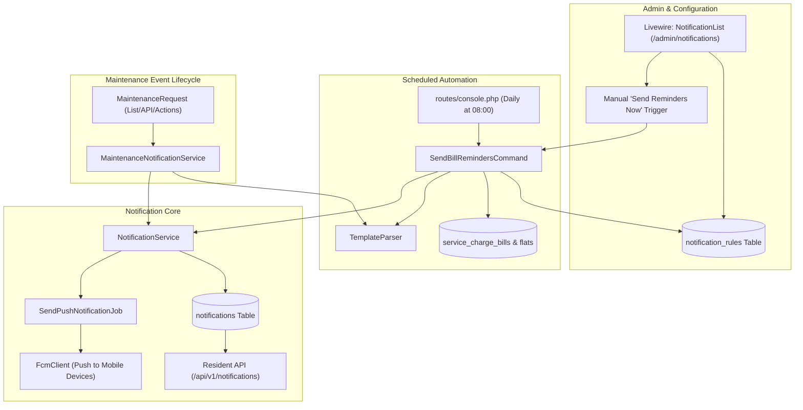

# Automatic Reminders & Advanced Notification Management Implementation Plan

> **For agentic workers:** REQUIRED SUB-SKILL: Use superpowers:subagent-driven-development to implement this plan task-by-task. Steps use checkbox (`- [ ]`) syntax for tracking.

**Goal:** Build a robust, configurable automated reminder and push notification system with dynamic template placeholders, scheduled bill reminders, real-time maintenance status alerts, and an administrative notification management center.

**Architecture:** A daily scheduled command queries unpaid bills against active `notification_rules` and dispatches idempotent push notifications and in-app alerts through `NotificationService`. A `MaintenanceNotificationService` handles real-time push dispatches for ticket creation, status transitions, technician assignments, and resolution notes. The Livewire `NotificationList` is enhanced with rule toggles, template editing with token chips, live preview, on-demand reminder dispatches, and delivery logs.

**Architecture Diagram:**

**Tech Stack:**
- PHP 8.5, Laravel 13, PostgreSQL 18
- Livewire 4, Tailwind CSS 4, Blade
- Firebase Cloud Messaging (FCM), PHPUnit 12

## Global Constraints
- Strictly maintain database precision for money calculations (`decimal(15,2)` with `bccomp`/`bcadd`).
- Idempotency key format: `bill_reminder:{bill_id}:{rule_id}:{date}` on `notifications.notification_key`.
- Tests must run with `php artisan test --compact` against PostgreSQL.
- Run `vendor/bin/pint --format agent` on modified PHP files.

---

### Task 1: Notification Rules Schema, Enums & Models

**Files:**
- Create: `database/migrations/2026_09_13_120000_create_notification_rules_table.php`
- Create: `app/Models/NotificationRule.php`
- Create: `database/factories/NotificationRuleFactory.php`
- Create: `database/seeders/NotificationRuleSeeder.php`
- Create: `app/Enums/NotificationTriggerEvent.php`
- Modify: `app/Enums/NotificationType.php`
- Test: `tests/Feature/NotificationRuleModelTest.php`

**Interfaces:**
- `NotificationTriggerEvent`: `BillDueUpcoming`, `BillDueToday`, `BillOverdue`, `MaintenanceStatusChanged`, `MaintenanceAssigned`, `MaintenanceCreated`
- `NotificationRule`: `belongsTo(Building::class)`, scopes for active rules and building overrides.

- [ ] **Step 1: Write the failing test for NotificationRule schema & model**
- [ ] **Step 2: Run test to confirm failure**
- [ ] **Step 3: Implement migration, Enums, NotificationRule model, Factory and Seeder**
- [ ] **Step 4: Run migration and test to confirm pass**
- [ ] **Step 5: Run Pint and commit**

---

### Task 2: Dynamic Template Parser Utility

**Files:**
- Create: `app/Services/Notification/TemplateParser.php`
- Test: `tests/Unit/TemplateParserTest.php`

**Interfaces:**
- `TemplateParser::parse(string $template, array $data): string`
  Substitutes `{resident_name}`, `{flat_number}`, `{amount}`, `{due_date}`, `{billing_month}`, `{ticket_id}`, `{ticket_title}`, `{ticket_status}`, `{assigned_to}`, `{resolution_notes}`.

- [ ] **Step 1: Write failing unit test for TemplateParser**
- [ ] **Step 2: Implement TemplateParser with placeholder replacement and formatting**
- [ ] **Step 3: Run unit tests to confirm all placeholder tests pass**
- [ ] **Step 4: Run Pint and commit**

---

### Task 3: Scheduled Bill Reminders Command & Daily Automation

**Files:**
- Create: `app/Console/Commands/SendBillRemindersCommand.php`
- Modify: `routes/console.php`
- Test: `tests/Feature/SendBillRemindersCommandTest.php`

**Interfaces:**
- Command: `php artisan notifications:send-bill-reminders {--dry-run} {--building=}`
- Consumes: `NotificationRule`, `ServiceChargeBill`, `TemplateParser`, `NotificationService`
- Produces: Dispatches notifications with idempotency key `bill_reminder:{bill_id}:{rule_id}:{date}`.

- [ ] **Step 1: Write failing feature tests covering upcoming due date (-3 days), due today (0 days), overdue (+2 days), paid bills exclusion, and idempotency**
- [ ] **Step 2: Implement `SendBillRemindersCommand` logic and register schedule in `routes/console.php`**
- [ ] **Step 3: Run feature tests to verify command execution**
- [ ] **Step 4: Run Pint and commit**

---

### Task 4: Maintenance Lifecycle Notification Service & Event Hooking

**Files:**
- Create: `app/Services/Notification/MaintenanceNotificationService.php`
- Modify: `app/Livewire/Admin/MaintenanceRequestList.php`
- Modify: `app/Http/Controllers/Api/V1/Resident/MaintenanceRequestApiController.php`
- Test: `tests/Feature/MaintenanceNotificationServiceTest.php`

**Interfaces:**
- `MaintenanceNotificationService::notifyStatusChange(MaintenanceRequest $ticket, ?string $previousStatus)`
- `MaintenanceNotificationService::notifyAssignment(MaintenanceRequest $ticket)`
- `MaintenanceNotificationService::notifyTicketCreated(MaintenanceRequest $ticket)`

- [ ] **Step 1: Write failing feature tests for maintenance status change, assignment, and resolution notes notifications**
- [ ] **Step 2: Implement `MaintenanceNotificationService` utilizing `NotificationRule` templates and `TemplateParser`**
- [ ] **Step 3: Integrate service calls into `MaintenanceRequestList` and `MaintenanceRequestApiController`**
- [ ] **Step 4: Run feature tests to verify dispatches and payloads**
- [ ] **Step 5: Run Pint and commit**

---

### Task 5: Admin Notification Management Hub UI

**Files:**
- Modify: `app/Livewire/Admin/NotificationList.php`
- Modify: `resources/views/livewire/admin/notification-list.blade.php`
- Test: `tests/Feature/AdminNotificationManagementTest.php`

**Interfaces:**
- Rule management: toggle `is_active`, edit days offset & templates with placeholder badge chips and live preview.
- "Send Reminders Now" on-demand trigger with preview count modal.
- Enhanced log viewing with FCM status and recipient details.

- [ ] **Step 1: Write failing feature test for admin rule updating, previewing, and on-demand trigger**
- [ ] **Step 2: Enhance `NotificationList` Livewire component with rule management methods & on-demand dispatch**
- [ ] **Step 3: Update `notification-list.blade.php` with tabbed navigation (Rules, Logs, Broadcast)**
- [ ] **Step 4: Run feature test and verify UI interactions**
- [ ] **Step 5: Run Pint and commit**

---

### Task 6: End-to-End Verification & Suite Check

**Files:**
- Run all tests across the suite
- Run static analysis (`composer analyse`)
- Run pre-commit checks (`composer check`)

- [ ] **Step 1: Execute full test suite `php artisan test --compact`**
- [ ] **Step 2: Execute `composer analyse` (Larastan)**
- [ ] **Step 3: Execute `composer check`**
- [ ] **Step 4: Final verification and commit**
