# Notification System Safety Confirmation Dialogs Implementation Plan

> **For agentic workers:** REQUIRED SUB-SKILL: Use superpowers:subagent-driven-development to implement this plan task-by-task. Steps use checkbox (`- [ ]`) syntax for tracking.

**Goal:** Implement robust, informative safety confirmation dialogs for all notification dispatch and automated reminder trigger actions in the Notification & Automation Hub (`NotificationList`), preventing accidental mass push alerts and ensuring clear operator visibility before broadcasting.

**Architecture:**
- Update `NotificationList` Livewire component to introduce a staging and dry-run confirmation state for broadcast notifications (`showBroadcastConfirmModal`, `broadcastSummary`).
- When submitting the broadcast form, validate input, resolve recipient counts and details, and open a structured safety confirmation dialog before dispatching.
- Upgrade the automated reminder confirmation modal to provide detailed bill/recipient breakdown, active rule summary, and safety safeguards.
- Add comprehensive automated tests in `NotificationListTest` and `AdminNotificationManagementTest` covering the confirmation flows, cancellation, and execution.

**Architecture Diagram:**

```mermaid
flowchart TD
    subgraph "Broadcast Notification Flow"
        A[Operator Fills Broadcast Form] --> B[Clicks 'Dispatch Broadcast']
        B --> C[Validate Form Inputs]
        C -->|Invalid| D[Show Validation Errors Inline]
        C -->|Valid| E[Resolve Recipients & Calculate Counts]
        E --> F[Display Safety Confirmation Dialog]
        F -->|Cancel / Close| G[Stay on Form with State Preserved]
        F -->|Confirm & Dispatch| H[Execute NotificationService::send]
        H --> I[Queue Push Jobs & Flash Success Notice]
    end

    subgraph "Automated Reminders Flow"
        J[Operator clicks 'Run Reminders Now'] --> K[Run Dry-Run Bill & Rule Evaluation]
        K --> L[Display Reminders Confirmation Dialog with Breakdown]
        L -->|Cancel| M[Close Dialog]
        L -->|Confirm & Send| N[Execute notifications:send-bill-reminders Artisan Command]
        N --> O[Flash Success Notice]
    end
```



**Tech Stack:** Laravel 11, Livewire 3, Tailwind CSS, Alpine.js, PHPUnit.

---

## Proposed Changes

Grouped by component and feature layer.

---

### Component: Livewire Component & Server Logic

#### [MODIFY] [`app/Livewire/Admin/NotificationList.php`](file:///Users/fazlerabbi/Desktop/Projects/tonmoy/build-utility-accounts-system/app/Livewire/Admin/NotificationList.php)

- Add confirmation state properties:
  - `public bool $showBroadcastConfirmModal = false;`
  - `public ?array $broadcastSummary = null;`
- Modify `sendNotification()` to act as the staging validator:
  - Validates `sendTitle`, `sendBody`, `sendTarget`, `sendUserId`.
  - Resolves recipients and calculates count and preview summary.
  - If 0 recipients found, flags error without opening confirmation.
  - If valid, populates `$broadcastSummary` and sets `$showBroadcastConfirmModal = true`.
- Add `cancelBroadcastConfirm()`:
  - Closes confirmation modal and clears `$broadcastSummary`, keeping form inputs intact.
- Add `confirmSendBroadcast()`:
  - Re-verifies validation and recipients.
  - Executes `app(NotificationService::class)->send(...)`.
  - Resets broadcast form and confirmation modal.
  - Flashes success notice.
- Enhance `previewReminders()` and `sendRemindersNow()`:
  - Provide richer breakdown in `dryRunSummary` (upcoming, due today, overdue bill counts).

---

### Component: Blade Views & UI Components

#### [MODIFY] [`resources/views/livewire/admin/notification-list.blade.php`](file:///Users/fazlerabbi/Desktop/Projects/tonmoy/build-utility-accounts-system/resources/views/livewire/admin/notification-list.blade.php)

- In the Broadcast Tab (Tab 3):
  - Change `<form wire:submit="sendNotification">` to trigger the confirmation staging flow.
  - Add `<button type="submit" wire:loading.attr="disabled">` with spinner state.
- Add the **Broadcast Safety Confirmation Dialog**:
  - Displays target audience name and description (e.g. *All Residents*, *Owners Only*, *Single User*).
  - Displays recipient badge / count (e.g. *14 recipients*).
  - Displays preview of title and announcement body.
  - Warns that push notifications will be queued immediately and cannot be recalled.
  - Contains **Cancel** and **Confirm & Dispatch** buttons with loading indicator (`wire:loading`).
- Polish the **Automated Reminders Confirmation Dialog**:
  - Detailed dry-run stats breakdown.
  - Safety warning and confirmation buttons.

---

### Component: Automated Tests

#### [MODIFY] [`tests/Feature/Livewire/Admin/NotificationListTest.php`](file:///Users/fazlerabbi/Desktop/Projects/tonmoy/build-utility-accounts-system/tests/Feature/Livewire/Admin/NotificationListTest.php)

- Test broadcast safety confirmation modal opening with summary on valid form submit.
- Test broadcast cancellation leaving state intact and sending nothing.
- Test confirmed broadcast dispatching push notifications and clearing modal.

#### [MODIFY] [`tests/Feature/AdminNotificationManagementTest.php`](file:///Users/fazlerabbi/Desktop/Projects/tonmoy/build-utility-accounts-system/tests/Feature/AdminNotificationManagementTest.php)

- Test broadcast safety confirmation with building-scoped resident filtering.
- Test reminders dry-run preview and confirmed execution.

---

## Tasks & Execution Plan

### Task 1: Add Broadcast Confirmation Flow in Livewire Component

**Files:**
- Modify: [`app/Livewire/Admin/NotificationList.php`](file:///Users/fazlerabbi/Desktop/Projects/tonmoy/build-utility-accounts-system/app/Livewire/Admin/NotificationList.php)

- [ ] **Step 1: Update `NotificationList.php` with confirmation state and methods**
  - Add `$showBroadcastConfirmModal` and `$broadcastSummary`.
  - Update `sendNotification()` to validate and prepare `$broadcastSummary` and set `$showBroadcastConfirmModal = true`.
  - Add `cancelBroadcastConfirm()` to close the modal.
  - Add `confirmSendBroadcast()` to perform actual dispatch and notification creation.

---

### Task 2: Implement UI Safety Confirmation Dialog in Blade View

**Files:**
- Modify: [`resources/views/livewire/admin/notification-list.blade.php`](file:///Users/fazlerabbi/Desktop/Projects/tonmoy/build-utility-accounts-system/resources/views/livewire/admin/notification-list.blade.php)

- [ ] **Step 1: Add Broadcast Safety Confirmation Modal in `notification-list.blade.php`**
  - Render confirmation dialog when `$showBroadcastConfirmModal` is true.
  - Display target audience, recipient count badge, title/body preview, and safety notice.
  - Wire cancel to `cancelBroadcastConfirm` and confirm button to `confirmSendBroadcast`.
  - Ensure `wire:loading.attr="disabled"` on all action buttons.

- [ ] **Step 2: Polish Reminders Confirmation Modal**
  - Ensure consistent styling, accessibility attributes, and clear warning copy.

---

### Task 3: Update and Expand Automated Feature Tests

**Files:**
- Modify: [`tests/Feature/Livewire/Admin/NotificationListTest.php`](file:///Users/fazlerabbi/Desktop/Projects/tonmoy/build-utility-accounts-system/tests/Feature/Livewire/Admin/NotificationListTest.php)
- Modify: [`tests/Feature/AdminNotificationManagementTest.php`](file:///Users/fazlerabbi/Desktop/Projects/tonmoy/build-utility-accounts-system/tests/Feature/AdminNotificationManagementTest.php)

- [ ] **Step 1: Update existing tests in `NotificationListTest.php`**
  - Update `test_staff_can_send_manual_notification_to_all_residents` and `test_staff_can_send_manual_notification_to_single_user` to test the two-step confirmation flow (`sendNotification` -> verify modal & summary -> `confirmSendBroadcast`).
  - Add test for cancelling broadcast confirmation (`cancelBroadcastConfirm`).

- [ ] **Step 2: Update `AdminNotificationManagementTest.php`**
  - Verify broadcast and reminder dry-run flows pass with building isolation.

- [ ] **Step 3: Run test suite**
  - Run `php artisan test tests/Feature/Livewire/Admin/NotificationListTest.php tests/Feature/AdminNotificationManagementTest.php`.

---

## Verification Plan

### Automated Tests
```bash
php artisan test tests/Feature/Livewire/Admin/NotificationListTest.php
php artisan test tests/Feature/AdminNotificationManagementTest.php
```

### Manual Verification
1. Navigate to **Admin Notifications & Automation Hub** (`/admin/notifications`).
2. Go to **Broadcast & Reminders** tab.
3. Fill in title, body, and audience (e.g. *All Residents*).
4. Click **Dispatch Broadcast** -> Verify the Safety Confirmation Dialog appears showing audience, recipient count, and body preview.
5. Click **Cancel** -> Verify dialog closes, message is NOT sent, form inputs remain preserved.
6. Click **Dispatch Broadcast** again -> Click **Confirm & Send** -> Verify push notifications are dispatched, success notification banner appears, and form is reset.
7. Click **Run Reminders Now** -> Verify reminders dry-run confirmation dialog opens with bill and recipient statistics before triggering.
