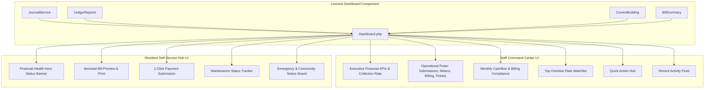

# Dashboard Revamp Implementation Plan

> **For agentic workers:** REQUIRED SUB-SKILL: Use superpowers:subagent-driven-development to implement this plan task-by-task. Steps use checkbox (`- [ ]`) syntax for tracking.

**Goal:** Transform the application dashboard into an Executive Command Center for Admin/Staff and an intuitive Self-Service Hub for Residents, presenting complete building operations, financials, and actions at a single glance ("on a peep").

**Architecture:** Extend `App\Livewire\Dashboard` to aggregate monthly billing, collection progress, expenses, meter readings status, and overdue accounts via existing `JournalService` and Eloquent queries. Revamp `resources/views/livewire/dashboard.blade.php` with responsive Tailwind CSS executive KPI cards, action pulse badges, defaulter watchlists, and quick action toolbars.

**Architecture Diagram:**



**Tech Stack:** PHP 8.2+, Laravel 12, Livewire 3, Tailwind CSS v4, Alpine.js

## Global Constraints

- Never mutate the ledger directly; read balances through `JournalService` or ledger aggregations.
- Scope all staff queries to the currently selected building via `CurrentBuilding`.
- Keep blade templates responsive (`sm:`, `md:`, `lg:` breakpoints) and accessible.
- Support both English (`en`) and Bengali (`bn`) locales.
- All code changes must pass PHPUnit test suite (`php artisan test`).

---

### Task 1: Translation Keys for Dashboard Revamp

**Files:**
- Modify: `lang/en/dashboard.php`
- Modify: `lang/bn/dashboard.php`

**Interfaces:**
- Produces: Localized strings for new KPI labels, operational pulse badges, quick actions, defaulters table, and resident status badges.

- [ ] **Step 1: Update English dashboard translations**

Add keys for collection rates, liquid funds, net cashflow, operational pulse, quick actions, and defaulters:

```php
// In lang/en/dashboard.php:
return [
    'welcome_back' => 'Welcome back, :name',
    'my_flats' => 'My Flats',
    'select_flat' => 'Select Flat',
    'total_due' => 'Total Payable Now',
    'current_bill' => 'Current Month Charges',
    'arrears' => 'Arrears (b/f)',
    'advance_available' => 'Advance Available',
    'view_statement' => 'View Full Statement',
    'latest_bill' => 'Latest Bill',
    'no_bills_yet' => 'No bills have been generated for this flat yet.',
    'bill_no' => 'Bill #',
    'month' => 'Month',
    'due_date' => 'Due Date',
    'print_bill' => 'Print Bill',
    'recent_payments' => 'Recent Payments',
    'no_payments_yet' => 'No payments recorded for this flat yet.',
    'receipt_no' => 'Receipt #',
    'payment_date' => 'Date',
    'amount' => 'Amount',
    'method' => 'Method',
    'print_receipt' => 'Print Receipt',
    'notices_announcements' => 'Announcements & Notices',
    'no_notices' => 'No active notices at this time.',
    'view_notice' => 'Read Notice',
    'maintenance_requests' => 'Maintenance & Service Requests',
    'report_issue' => 'Report an Issue',
    'no_issues_reported' => 'No issues reported for this flat.',
    
    // New Staff Command Center Keys
    'financial_overview' => 'Executive Overview',
    'this_month' => 'This Month',
    'collected_of_target' => ':collected collected of :target billed',
    'collection_rate' => 'Collection Rate',
    'liquid_funds' => 'Liquid Funds',
    'cash_and_bank' => 'Cash + Bank in hand',
    'net_cashflow' => 'Net Cashflow',
    'surplus' => 'Surplus',
    'deficit' => 'Deficit',
    'income_vs_expense' => 'Income vs Expense',
    'total_expenses' => 'Total Expenses',
    'operational_pulse' => 'Action Pipeline & Status',
    'pending_approvals' => 'Pending Approvals',
    'meter_readings' => 'Meter Readings',
    'readings_recorded' => ':recorded of :total meters logged',
    'bill_generation' => 'Bill Generation',
    'bills_generated_status' => ':count of :total flats billed',
    'bills_ready' => 'Generated for :month',
    'bills_pending_generation' => 'Pending generation for :month',
    'urgent_tickets' => 'Urgent Issues',
    'open_tickets' => ':open open (:urgent urgent)',
    'quick_actions' => 'Quick Actions',
    'generate_bills_now' => 'Generate Bills',
    'record_payment' => 'Record Payment',
    'add_expense' => 'Add Expense',
    'log_meter_reading' => 'Log Meter Reading',
    'post_announcement' => 'Post Notice',
    'defaulter_watchlist' => 'Top Overdue Accounts',
    'no_defaulters' => 'No overdue accounts found.',
    'flat_owner' => 'Flat & Owner',
    'overdue_amount' => 'Overdue',
    'view_ledger' => 'Ledger',
    'billing_compliance' => 'Billing Compliance',
    'paid_flats' => 'Paid',
    'partially_paid_flats' => 'Partial',
    'unpaid_flats' => 'Unpaid',
    'recent_activities' => 'Recent Activities',
    'recent_tickets' => 'Recent Maintenance Requests',
    
    // Resident Enhanced Keys
    'status_all_clear' => 'All Clear • No Outstanding Dues',
    'status_payment_due' => 'Payment Due: :amount',
    'pay_now' => 'Pay / Submit Proof',
    'itemized_breakdown' => 'Itemized Breakdown',
    'service_charge' => 'Service Charge',
    'utility_meter' => 'Utility Consumption',
    'adhoc_charges' => 'Ad-hoc & Special',
];
```

- [ ] **Step 2: Update Bengali dashboard translations**

Add corresponding Bengali translations in `lang/bn/dashboard.php`.

- [ ] **Step 3: Commit translation changes**

```bash
git add lang/en/dashboard.php lang/bn/dashboard.php
git commit -m "feat(i18n): add comprehensive dashboard translation keys"
```

---

### Task 2: Backend Metric Aggregation in `Dashboard.php`

**Files:**
- Modify: `app/Livewire/Dashboard.php`

**Interfaces:**
- Consumes: `CurrentBuilding`, `JournalService`, `BillSummary`, Eloquent models (`Payment`, `Expense`, `ServiceChargeBill`, `Meter`, `MeterReading`, `MaintenanceRequest`, `PaymentSubmission`, `Flat`).
- Produces: Aggregated view data passed to `livewire.dashboard`:
  - `collectedThisMonth`, `billedThisMonth`, `collectionPercentage`
  - `liquidCash`, `liquidBank`, `totalLiquid`
  - `expensesThisMonth`, `netCashflow`, `isSurplus`
  - `totalMetersCount`, `recordedMetersCount`, `isMeterReadingComplete`
  - `flatsBilledCount`, `isBillingCompleteForMonth`
  - `urgentTicketsCount`, `openTicketsCount`
  - `topOverdueFlats` (top 5 with flat, owner, and overdue balance)
  - `billingCompliance` (counts of paid, partial, unpaid)
  - `recentStaffPayments`, `recentStaffTickets`

- [ ] **Step 1: Implement data retrieval in `Dashboard::render()` for staff**

Calculate exact financial & operational metrics:
```php
// In Dashboard.php:
$building = $current->get();

if ($building !== null) {
    $activeFlats = $building->activeFlats()->with('owner.user')->get();
    $activeFlatIds = $activeFlats->pluck('id');
    $flatCount = $activeFlats->count();
    $currentMonthStr = now()->format('Y-m');

    // Monthly Bills & Targets
    $monthBills = ServiceChargeBill::whereIn('flat_id', $activeFlatIds)
        ->where('billing_month', $currentMonthStr)
        ->get();
    
    $billedThisMonth = (string) $monthBills->sum('total_amount');
    $flatsBilledCount = $monthBills->count();
    $isBillingCompleteForMonth = $flatCount > 0 && $flatsBilledCount >= $flatCount;

    // Billing Compliance
    $paidBillsCount = $monthBills->where('status', \App\Enums\BillStatus::Paid)->count();
    $partialBillsCount = $monthBills->where('status', \App\Enums\BillStatus::PartiallyPaid)->count();
    $unpaidBillsCount = $monthBills->where('status', \App\Enums\BillStatus::Unpaid)->count();

    // Monthly Collections
    $collectedThisMonth = (string) Payment::whereIn('flat_id', $activeFlatIds)
        ->whereBetween('received_on', [now()->startOfMonth(), now()->endOfMonth()])
        ->sum('amount');

    $collectionPercentage = bccomp($billedThisMonth, '0', 2) > 0
        ? min(100, (int) round(((float) $collectedThisMonth / (float) $billedThisMonth) * 100))
        : 0;

    // Monthly Expenses
    $expensesThisMonth = (string) \App\Models\Expense::where('building_id', $building->id)
        ->whereBetween('expense_date', [now()->startOfMonth(), now()->endOfMonth()])
        ->sum('amount');

    $netCashflow = bcsub($collectedThisMonth, $expensesThisMonth, 2);
    $isSurplus = bccomp($netCashflow, '0', 2) >= 0;

    // Liquid Balances
    $cash = $journal->balanceFor($journal->account(AccountCode::CashInHand));
    $bank = $journal->balanceFor($journal->account(AccountCode::Bank));
    $totalLiquid = bcadd($cash, $bank, 2);

    // Meter Readings Status
    $activeMeters = \App\Models\Meter::where('building_id', $building->id)->where('is_active', true)->get();
    $totalMetersCount = $activeMeters->count();
    $recordedMetersCount = $totalMetersCount > 0
        ? \App\Models\MeterReading::whereIn('meter_id', $activeMeters->pluck('id'))
            ->where('billing_period', $currentMonthStr)
            ->distinct('meter_id')
            ->count('meter_id')
        : 0;
    $isMeterReadingComplete = $totalMetersCount === 0 || $recordedMetersCount >= $totalMetersCount;

    // Maintenance Tickets
    $openTickets = MaintenanceRequest::where('building_id', $building->id)
        ->whereIn('status', [MaintenanceStatus::Open, MaintenanceStatus::InProgress])
        ->get();
    $openTicketsCount = $openTickets->count();
    $urgentTicketsCount = $openTickets->whereIn('priority', [MaintenancePriority::High, MaintenancePriority::Emergency])->count();

    // Top Overdue Flats (Top 5)
    $receivableAccount = $journal->account(AccountCode::ServiceChargeReceivable);
    $overdueFlats = collect();
    foreach ($activeFlats as $flat) {
        $due = $journal->balanceFor($receivableAccount, $flat->id);
        if (bccomp($due, '0', 2) > 0) {
            $overdueFlats->push([
                'flat' => $flat,
                'due' => $due,
            ]);
        }
    }
    $topOverdueFlats = $overdueFlats->sortByDesc(fn ($item) => (float) $item['due'])->take(5)->values();

    // Recent Payments & Tickets
    $recentStaffPayments = Payment::whereIn('flat_id', $activeFlatIds)
        ->with(['flat.owner'])
        ->latest('received_on')
        ->latest('id')
        ->take(5)
        ->get();

    $recentStaffTickets = MaintenanceRequest::where('building_id', $building->id)
        ->with(['flat', 'user'])
        ->latest('created_at')
        ->take(5)
        ->get();
}
```

- [ ] **Step 2: Pass all variables to view payload**

Ensure both staff and non-staff render branches pass full structured data.

- [ ] **Step 3: Commit backend changes**

```bash
git add app/Livewire/Dashboard.php
git commit -m "feat(dashboard): aggregate complete operational and financial metrics in Dashboard component"
```

---

### Task 3: Admin / Staff Command Center UI Revamp

**Files:**
- Modify: `resources/views/livewire/dashboard.blade.php`

**Interfaces:**
- Produces: Professional, responsive executive dashboard view with 4 Top KPI Cards, 4 Operational Pulse Badges, 2-column Analytics + Defaulter Watchlist, Quick Action Toolbar, and Activity Feeds.

- [ ] **Step 1: Build Quick Actions Bar & Header in `resources/views/livewire/dashboard.blade.php`**

Add action buttons for:
- 📑 `Generate Bills` (`route('billing.generate')`)
- 💳 `Record Payment` (`route('payments.create')`)
- 💸 `Add Expense` (`route('expenses.index')`)
- ⚡ `Log Readings` (`route('readings.index')`)
- 📢 `Post Notice` (`route('notices.index')`)

- [ ] **Step 2: Build 4 Executive Financial KPI Cards**

1. **Monthly Collection Card**:
   - Huge amount collected: `৳{{ number_format($collectedThisMonth, 2) }}`
   - Subtitle: `of ৳{{ number_format($billedThisMonth, 2) }} billed`
   - Progress bar showing `:style="'width: ' . $collectionPercentage . '%'"` with badge `{{ $collectionPercentage }}%`
2. **Total Outstanding Dues Card**:
   - Total Receivable: `৳{{ number_format($totalReceivable, 2) }}`
   - Subtitle: `{{ $unpaidBills }} unpaid bills across flats`
   - Direct link to `route('reports.owner-dues')`
3. **Liquid Funds (Cash + Bank) Card**:
   - Total: `৳{{ number_format($totalLiquid, 2) }}`
   - Breakdown badges: `Cash: ৳{{ number_format($cash, 2) }}` | `Bank: ৳{{ number_format($bank, 2) }}`
   - Direct link to `route('reports.cash-book')`
4. **Monthly Net Cashflow Card**:
   - Net Cashflow: `৳{{ number_format($netCashflow, 2) }}`
   - Badge: `{{ $isSurplus ? 'Surplus' : 'Deficit' }}` (Green / Red)
   - Breakdown: `In: ৳{{ number_format($collectedThisMonth, 2) }} | Out: ৳{{ number_format($expensesThisMonth, 2) }}`

- [ ] **Step 3: Build 4 Operational Pulse Interactive Action Cards**

1. **🔔 Pending Payment Approvals**:
   - Count: `{{ $pendingSubmissionsCount }}`
   - Action: `route('billing.submissions')`
   - Color: Amber if > 0, Slate if 0.
2. **⚡ Meter Readings Status**:
   - Count: `{{ $recordedMetersCount }}/{{ $totalMetersCount }} recorded`
   - Action: `route('readings.index')`
   - Badge: `Complete` (Green) or `Pending` (Amber)
3. **📑 Monthly Bill Generation**:
   - Status: `{{ $flatsBilledCount }}/{{ $flatCount }} flats billed`
   - Action: `route('billing.generate')`
   - Badge: `Generated` (Green) or `Action Required` (Indigo)
4. **🛠️ Maintenance Issues**:
   - Count: `{{ $openTicketsCount }} open` (`{{ $urgentTicketsCount }} urgent`)
   - Action: `route('maintenance-requests.index')`
   - Badge: Red if urgent > 0, Slate if none.

- [ ] **Step 4: Build Analytics & Defaulters 2-Column Row**

- **Left (Analytics & Compliance)**:
  - Visual Billing Compliance Bar (Paid / Partial / Unpaid counts and proportions)
  - Income vs Expense comparative snapshot
- **Right (Top Overdue Accounts Watchlist)**:
  - High-contrast table of top 5 overdue flats with Owner name, Flat number, Overdue amount, and direct link to Statement.

- [ ] **Step 5: Build Recent Activities Feeds**

- Latest 5 Payments Collected (with receipt link).
- Latest 5 Maintenance Tickets.

- [ ] **Step 6: Commit Staff UI revamp**

```bash
git add resources/views/livewire/dashboard.blade.php
git commit -m "feat(dashboard): implement executive command center layout for staff"
```

---

### Task 4: Resident / Tenant / Owner Self-Service Hub UI Revamp

**Files:**
- Modify: `resources/views/livewire/dashboard.blade.php`

**Interfaces:**
- Produces: Polished Resident Hub featuring high-contrast Financial Health Hero banner, itemized bill preview, payment submission tracking, maintenance ticket status badges, and notice board.

- [ ] **Step 1: Build Financial Health Hero Banner**

- State A (No dues): Emerald themed card with `✓ All Clear • No Outstanding Dues`, Advance balance held, and statement link.
- State B (Dues payable): Rose/Amber themed card with `৳{{ number_format($totalDue, 2) }} Payable`, breakdown of Arrears + Current Bill - Advance, and prominent `💳 Submit Payment Proof` button.

- [ ] **Step 2: Refine Itemized Bill Preview & Print**

- Display itemized lines (Service Charge, Water, Electricity, Gas, Ad-hoc).
- Prominent `Print / Download Bill` button.

- [ ] **Step 3: Enhance Payment Submissions & Recent Receipts**

- Table showing submission reference, date, method, amount, and badge (`Pending`, `Approved`, `Rejected` with reason tooltip).
- Quick receipt print for verified payments.

- [ ] **Step 4: Enhance Notice Board & Maintenance Tracker**

- Pinned emergency notices highlighted in top banner.
- Ticket status badges with resolution notes preview.

- [ ] **Step 5: Commit Resident UI revamp**

```bash
git add resources/views/livewire/dashboard.blade.php
git commit -m "feat(dashboard): enhance resident self-service hub with clear status cards"
```

---

### Task 5: Feature Tests & Verification

**Files:**
- Create: `tests/Feature/DashboardTest.php`

**Interfaces:**
- Consumes: Test factories for `User`, `Building`, `Flat`, `Owner`, `ServiceChargeBill`, `Payment`, `Expense`, `MaintenanceRequest`, `PaymentSubmission`.
- Verifies:
  - Admin/Staff sees correct calculated collections, liquid funds, meter status, and defaulter list.
  - Resident sees correct dues, bill preview, payment submissions, and ticket list.
  - Submitting payment modal works and records `PaymentSubmission`.
  - Reporting maintenance issue modal works and records `MaintenanceRequest`.

- [ ] **Step 1: Write Feature Tests in `tests/Feature/DashboardTest.php`**

```php
<?php

namespace Tests\Feature;

use App\Enums\AccountCode;
use App\Enums\MaintenanceCategory;
use App\Enums\MaintenancePriority;
use App\Enums\PaymentMethod;
use App\Livewire\Dashboard;
use App\Models\Building;
use App\Models\Flat;
use App\Models\Owner;
use App\Models\Payment;
use App\Models\ServiceChargeBill;
use App\Models\User;
use App\Services\JournalService;
use App\Support\CurrentBuilding;
use Illuminate\Foundation\Testing\RefreshDatabase;
use Livewire\Livewire;
use Tests\TestCase;

class DashboardTest extends TestCase
{
    use RefreshDatabase;

    public function test_staff_dashboard_renders_metrics_and_actions(): void
    {
        $user = User::factory()->create(['role' => 'admin']);
        $building = Building::factory()->create();
        app(CurrentBuilding::class)->set($building->id);
        
        $flat = Flat::factory()->create(['building_id' => $building->id]);

        Livewire::actingAs($user)
            ->test(Dashboard::class)
            ->assertOk()
            ->assertSee(__('dashboard.financial_overview'))
            ->assertSee(__('dashboard.operational_pulse'))
            ->assertSee(__('dashboard.quick_actions'));
    }

    public function test_resident_dashboard_renders_hero_status_and_bill(): void
    {
        $user = User::factory()->create(['role' => 'resident']);
        $building = Building::factory()->create();
        $owner = Owner::factory()->create(['user_id' => $user->id]);
        $flat = Flat::factory()->create([
            'building_id' => $building->id,
            'owner_id' => $owner->id,
            'number' => 'Flat 4A',
        ]);

        Livewire::actingAs($user)
            ->test(Dashboard::class)
            ->assertOk()
            ->assertSee('Flat 4A')
            ->assertSee(__('dashboard.itemized_breakdown'));
    }

    public function test_resident_can_submit_payment_proof(): void
    {
        $user = User::factory()->create(['role' => 'resident']);
        $building = Building::factory()->create();
        $owner = Owner::factory()->create(['user_id' => $user->id]);
        $flat = Flat::factory()->create([
            'building_id' => $building->id,
            'owner_id' => $owner->id,
        ]);

        Livewire::actingAs($user)
            ->test(Dashboard::class)
            ->call('openPaymentModal', '2500.00')
            ->set('submissionAmount', '2500.00')
            ->set('submissionMethod', PaymentMethod::Bkash->value)
            ->set('submissionReference', 'TRX998877')
            ->set('submissionDate', now()->toDateString())
            ->call('submitPayment')
            ->assertHasNoErrors();

        $this->assertDatabaseHas('payment_submissions', [
            'flat_id' => $flat->id,
            'amount' => '2500.00',
            'reference_number' => 'TRX998877',
        ]);
    }
}
```

- [ ] **Step 2: Run tests to verify**

Run: `php artisan test tests/Feature/DashboardTest.php`
Expected: PASS

- [ ] **Step 3: Run complete test suite**

Run: `php artisan test`
Expected: All tests PASS

- [ ] **Step 4: Commit test suite**

```bash
git add tests/Feature/DashboardTest.php
git commit -m "test: add comprehensive dashboard feature tests"
```
