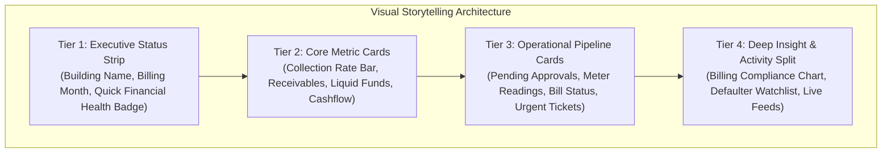

# Dashboard UI & UX Refinement Plan (At-a-Glance Clarity)

> **For agentic workers:** REQUIRED SUB-SKILL: Use superpowers:subagent-driven-development to implement this plan task-by-task. Steps use checkbox (`- [ ]`) syntax for tracking.

**Goal:** Elevate the dashboard UI to an ultra-clean, modern SaaS standard with clear visual storytelling, refined typography, intuitive color coding, and crisp micro-indicators so any user immediately understands the full operational and financial story at a single glance.

**Architecture:** Refactor `resources/views/livewire/dashboard.blade.php` to use a 4-tier visual storytelling hierarchy (Executive Story Strip, Primary Metric Cards, Operational Pulse, Detailed Defaulter & Activity Feeds). Replace raw emojis with refined, accessible SVGs, enhance contrast and spatial breathing room, and polish state transitions.

**Architecture Diagram:**

**Tech Stack:** Tailwind CSS v4, Blade, Livewire 3, Alpine.js

## Global Constraints

- Preserve all existing data variables and business logic in `Dashboard.php`.
- Ensure strict contrast ratios (WCAG AA) for all text and background combinations.
- Keep the interface completely bilingual (en/bn).
- Ensure mobile/tablet responsive behavior (`sm:`, `md:`, `lg:`).
- Pass all automated test suites (`php artisan test`).

---

### Task 1: Refine Staff Command Center Layout & Visual Hierarchy

**Files:**
- Modify: `resources/views/livewire/dashboard.blade.php`

**Key UI Refinements:**
1. **Header & Context Strip**:
   - Modern breadcrumb/badge styling for building & billing cycle.
   - Distinct, grouped Quick Action pill buttons with subtle icons and hover elevations.
2. **4 Core Financial Metric Cards**:
   - Distinct icon badges for each metric (Trending Up for collections, Exclamation/Invoice for receivables, Wallet/Vault for liquid funds, Scale/Bar for cashflow).
   - High-contrast typography with `tabular-nums` and clean subtitle alignment.
   - Dual-tone gradient progress bar for collection rate.
3. **Operational Pulse Cards**:
   - Interactive hover cards with subtle glow borders when action is required (e.g. pending approvals or pending meter readings).
   - Clean status badges with explicit state text.
4. **Billing Compliance & Defaulter Watchlist**:
   - Refined segmented bar for Paid/Partially Paid/Unpaid flats with percentages.
   - Clean table styling with rounded row hover effects, clear typography for owner names and flat numbers, and prominent `View Ledger` action buttons.
5. **Activity Stream Cards**:
   - Modern timeline cards with avatar initials/icons, formatted timestamps, and clear receipt links.

- [ ] **Step 1: Update Staff Dashboard Blade markup with refined design**
- [ ] **Step 2: Commit Staff UI changes**

---

### Task 2: Refine Resident Self-Service Hub Layout & Hero Banner

**Files:**
- Modify: `resources/views/livewire/dashboard.blade.php`

**Key UI Refinements:**
1. **Financial Health Hero Banner**:
   - Soft gradient container with high-contrast status badge.
   - Clear visual breakdown of `Arrears`, `Current Bill`, and `Advance` in white glassmorphic sub-cards.
   - Prominent, high-visibility `Pay / Submit Proof` primary button.
2. **Latest Bill & Breakdown**:
   - Card with receipt styling, itemized list with zebra dividers, and print bill button.
3. **Payment Submissions & Receipts**:
   - Clean status badges (`Pending`, `Approved`, `Rejected`) with tooltip/reason text.
4. **Notice Board & Tickets**:
   - Urgent announcements highlighted in high-contrast alert boxes.
   - Maintenance requests with color-coded category and priority pills.

- [ ] **Step 1: Update Resident Dashboard Blade markup with refined design**
- [ ] **Step 2: Commit Resident UI changes**

---

### Task 3: Automated Testing & Verification

**Files:**
- Modify: `tests/Feature/DashboardTest.php`

- [ ] **Step 1: Run feature tests**
- [ ] **Step 2: Run full test suite (`php artisan test`)**
- [ ] **Step 3: Verify visual rendering in browser**
