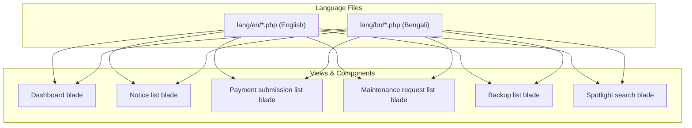

# Translation Keys Fix & System-Wide Localization Audit Plan

> **For agentic workers:** REQUIRED SUB-SKILL: Use superpowers:subagent-driven-development to implement this plan task-by-task. Steps use checkbox (`- [ ]`) syntax for tracking.

**Goal:** Resolve all missing translation keys in the Dashboard (`maintenance.view_requests`, `reports.collections`, etc.) and across the entire application in both English (`lang/en/`) and Bengali (`lang/bn/`), ensuring zero missing translation keys and 100% localized UI strings everywhere.

**Architecture:** Update language files (`maintenance.php`, `reports.php`, `billing.php`, `masters.php`, `nav.php`, `backup.php`, `dashboard.php`) in both `lang/en/` and `lang/bn/` with missing keys, update corresponding Blade templates where appropriate, and run an automated script to verify that 100% of `__()` translation calls resolve properly in both languages.

**Architecture Diagram:**

**Tech Stack:** PHP 8.2+, Laravel 12

## Global Constraints

- Keep translations accurate, natural, and professional in both English and Bengali.
- Do not introduce breaking changes to existing translation keys.
- Ensure all 729 automated tests pass cleanly (`php artisan test`).

---

### Task 1: Update Language Files with Missing Translation Keys

**Files:**
- Modify: `lang/en/maintenance.php` & `lang/bn/maintenance.php`
- Modify: `lang/en/reports.php` & `lang/bn/reports.php`
- Modify: `lang/en/billing.php` & `lang/bn/billing.php`
- Modify: `lang/en/masters.php` & `lang/bn/masters.php`
- Modify: `lang/en/nav.php` & `lang/bn/nav.php`
- Modify: `lang/en/backup.php` & `lang/bn/backup.php`

**Keys to Add:**
1. `maintenance.php`:
   - `'view_requests' => 'View Requests'` / `'view_requests' => 'অনুরোধসমূহ দেখুন'`
2. `reports.php`:
   - `'collections' => 'Collections'` / `'collections' => 'আদায়'`
3. `billing.php`:
   - `'total_charges' => 'Total Charges'` / `'total_charges' => 'মোট চার্জ'`
   - `'confirm_submission' => 'Confirm Submission'` / `'confirm_submission' => 'অনুমোদন নিশ্চিত করুন'`
4. `masters.php`:
   - `'view' => 'View'` / `'view' => 'দেখুন'`
   - `'details' => 'Details'` / `'details' => 'বিস্তারিত'`
   - `'description' => 'Description'` / `'description' => 'বিবরণ'`
   - `'account' => 'Account'` / `'account' => 'হিসাব'`
   - `'type' => 'Type'` / `'type' => 'ধরন'`
   - `'content' => 'Content'` / `'content' => 'বিষয়বস্তু'`
   - `'close' => 'Close'` / `'close' => 'বন্ধ করুন'`
5. `nav.php`:
   - `'general' => 'General'` / `'general' => 'সাধারণ'`
6. `backup.php`:
   - `'upload_file_types' => 'ZIP or ENC up to 500MB'` / `'upload_file_types' => 'ZIP বা ENC ফাইল (সর্বোচ্চ ৫০০ মেগাবাইট)'`

- [ ] **Step 1: Update English language files**
- [ ] **Step 2: Update Bengali language files**
- [ ] **Step 3: Commit language file updates**

---

### Task 2: Automated Verification & Project-Wide Test Run

**Files:**
- Test: Run translation audit script across all views.
- Test: Run PHPUnit test suite (`php artisan test`).

- [ ] **Step 1: Run translation audit command to verify 0 missing keys**
- [ ] **Step 2: Run `php artisan test` to verify all tests pass**
