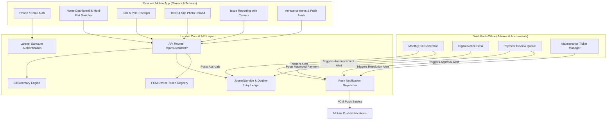

# Resident (Owner & Tenant) Mobile App Architecture & REST API Specification

**Date:** 2026-09-10  
**Target Audience:** Flat Owners & Renters (Tenants)  
**System Architecture:** Hybrid (Web Command Center for Management + Cross-Platform Mobile App for Residents)  
**Backend Framework:** Laravel 13, PHP 8.5, PostgreSQL 18, Laravel Sanctum, Firebase Cloud Messaging (FCM)  
**Mobile Client:** Flutter (Cross-platform iOS & Android)

---

## 1. Executive Summary & Problem Statement

The **Utility Accounts System** currently provides a robust web interface for administrative management, double-entry accounting, bill generation, and payment approvals. While residents (owners and tenants) can access the system via a web browser, mobile smartphones are their primary communication device. 

To ensure residents receive immediate updates when bills are generated, notices are posted, tickets are updated, and payments are approved, we are separating concerns:
* **Web Application:** Dedicated exclusively as the management command center for Admins, Accountants, Staff, and Committee members.
* **Mobile Application:** Dedicated exclusively to Flat Owners and Renters (Tenants) for self-service, instant push alerts, billing history, payment proof submissions, and maintenance ticketing.

---

## 2. User Roles & Capabilities

### 2.1. Flat Owner
* **Login & Identity:** Logs in via Phone number or Email + Password.
* **Multi-Flat Access:** If owning multiple flats (e.g. `Flat 2-B` and `Flat 5-A`), can seamlessly switch between them using an in-app selector.
* **Financial Inspection:**
  * View live verified balances derived from `JournalService` (Total Due, Arrears, Advance Held).
  * Itemized bill breakdown (Guard Salary, Lift, Common Electricity, Water/WASA, Generator, Ad-hoc charges).
  * Download official bilingual PDF bills and payment receipts.
* **Payment Reporting:** Submit offline payment proofs (bKash, Nagad, Bank transfer TrxID + slip photo) to management queue.
* **Maintenance & Community:** Submit apartment maintenance requests with photos; view pinned building notices.

### 2.2. Renter / Tenant
* **Leased Flat Scope:** Automatically scoped to their active leased flat.
* **Billing Awareness:** View service charge / utility charges assigned to the flat.
* **Maintenance & Ticketing:** Direct issue reporting (plumbing, electrical, common area issues) with photos and resolution tracking.
* **Community Notices:** Read all announcements, emergency notices, and facility schedules.

---

## 3. System Architecture & Component Diagram



---

## 4. Unified API Response Envelope

Every endpoint adheres strictly to a standard envelope.

### 4.1. Single Resource Envelope (200 OK / 201 Created)
```json
{
  "success": true,
  "message": "Resource retrieved successfully.",
  "data": {
    "id": 1,
    "number": "3-B",
    "floor": "3rd Floor",
    "building": {
      "id": 1,
      "name": "Green Valley Tower"
    }
  }
}
```

### 4.2. Paginated Collection Envelope (200 OK)
```json
{
  "success": true,
  "message": "Bills retrieved successfully.",
  "data": [
    {
      "id": 105,
      "bill_number": "BIL-2026-09-0012",
      "billing_month": "2026-09",
      "month_charges": "4500.00",
      "arrears": "1200.00",
      "total_payable": "5700.00",
      "status": "unpaid",
      "due_date": "2026-09-15"
    }
  ],
  "meta": {
    "current_page": 1,
    "last_page": 4,
    "per_page": 15,
    "total": 52,
    "from": 1,
    "to": 15
  },
  "links": {
    "first": "https://api.example.com/api/v1/resident/bills?page=1",
    "last": "https://api.example.com/api/v1/resident/bills?page=4",
    "prev": null,
    "next": "https://api.example.com/api/v1/resident/bills?page=2"
  }
}
```

### 4.3. Validation Error Envelope (422 Unprocessable Entity)
```json
{
  "success": false,
  "message": "The given data was invalid.",
  "errors": {
    "reference_number": [
      "The reference number field is required."
    ],
    "amount": [
      "The amount must be at least 0.01."
    ]
  }
}
```

### 4.4. Unauthorized / Forbidden / Not Found Envelope (401 / 403 / 404)
```json
{
  "success": false,
  "message": "You are not authorized to access this flat."
}
```

---

## 5. API Endpoint Specifications

### 5.1. Authentication & Device Tokens

| Method | Endpoint | Description | Request Body | Response Data |
|---|---|---|---|---|
| `POST` | `/api/v1/auth/login` | Authenticate resident | `{ "login": "017...", "password": "..." }` | User profile, token, roles, default flat |
| `POST` | `/api/v1/auth/logout` | Revoke current token | None | Success message |
| `GET` | `/api/v1/auth/me` | Fetch authenticated user | None | User profile, assigned flats |
| `POST` | `/api/v1/auth/fcm-token` | Register/Update push token | `{ "token": "...", "device_type": "android|ios" }` | Success status |
| `POST` | `/api/v1/auth/change-password` | Update account password | `{ "current_password": "...", "new_password": "..." }` | Success message |

### 5.2. Resident Dashboard & Multi-Flat

| Method | Endpoint | Description | Query Parameters | Response Data |
|---|---|---|---|---|
| `GET` | `/api/v1/resident/flats` | Get all flats linked to user | None | Array of flat objects (id, number, building) |
| `GET` | `/api/v1/resident/dashboard` | Primary dashboard metrics | `flat_id={id}` | Derived dues (`total_due`, `advance_held`, `month_charges`, `arrears`), latest bill, active notices, recent tickets |

### 5.3. Bills & Payments

| Method | Endpoint | Description | Filtering & Pagination | Response Data |
|---|---|---|---|---|
| `GET` | `/api/v1/resident/bills` | Paginated bill history | `flat_id={id}`, `status`, `year`, `page`, `per_page` | Paginated bills array |
| `GET` | `/api/v1/resident/bills/{bill}` | Detailed bill breakdown | None | Bill details + itemized charge heads |
| `GET` | `/api/v1/resident/bills/{bill}/pdf` | Printable bilingual PDF | None | PDF stream / temporary signed URL |
| `GET` | `/api/v1/resident/payments` | Posted ledger payments | `flat_id={id}`, `from_date`, `to_date`, `page` | Paginated payment records |
| `GET` | `/api/v1/resident/payments/{payment}/receipt`| Official receipt PDF | None | Receipt PDF stream / signed URL |

### 5.4. Payment Submissions (Offline Verification Queue)

| Method | Endpoint | Description | Request Payload | Response Data |
|---|---|---|---|---|
| `GET` | `/api/v1/resident/payment-submissions` | List submitted payments | `flat_id={id}`, `status`, `page` | Paginated submission records with reviewer notes |
| `POST` | `/api/v1/resident/payment-submissions` | Submit payment proof | `flat_id`, `amount`, `payment_method`, `reference_number`, `payment_date`, `resident_notes`, `slip` (file) | Created submission object |

### 5.5. Maintenance & Complaint Tickets

| Method | Endpoint | Description | Filtering & Query | Response Data |
|---|---|---|---|---|
| `GET` | `/api/v1/resident/maintenance-requests` | List flat tickets | `flat_id={id}`, `status`, `category`, `priority`, `page` | Paginated maintenance requests |
| `POST` | `/api/v1/resident/maintenance-requests` | Create new ticket | `flat_id`, `title`, `description`, `category`, `priority`, `attachment` (file) | Created ticket record |
| `GET` | `/api/v1/resident/maintenance-requests/{id}` | Ticket details & timeline | None | Ticket details, staff assignment, resolution notes |

### 5.6. Digital Notice Board

| Method | Endpoint | Description | Filtering & Query | Response Data |
|---|---|---|---|---|
| `GET` | `/api/v1/resident/notices` | Active building notices | `type`, `page`, `per_page` | Paginated active notices (pinned first) |
| `GET` | `/api/v1/resident/notices/{id}` | Full notice text | None | Full notice content and publisher info |

---

## 6. Push Notifications Architecture (Firebase Cloud Messaging)

### 6.1. Device Token Management
* Table: `user_device_tokens` (`id`, `user_id`, `token`, `device_type`, `created_at`, `updated_at`).
* Tokens are refreshed on mobile app launch and removed upon explicit logout.

### 6.2. Event Triggers
1. **Bill Generated:** Triggered by `BillGeneratedEvent` -> Dispatches `SendBillPushNotificationJob` to all owners/tenants of billed flats.
2. **Payment Approved/Rejected:** Triggered by operator review in `PaymentSubmissionList` -> Dispatches `SendPaymentStatusPushNotificationJob` to the submitting resident.
3. **New Notice Published:** Triggered by `Notice` creation -> Dispatches `SendNoticeBroadcastJob` to all active residents in that building.
4. **Ticket Status Changed:** Triggered when ticket is marked `In Progress` or `Resolved` -> Dispatches `SendTicketUpdateNotificationJob`.

---

## 7. Mobile App Client Architecture (Flutter)

* **Architecture Pattern:** Feature-First BLoC / Clean Architecture.
* **Network Client:** `Dio` with authentication interceptor for automatic Bearer token injection and centralized 401 token expiry handling.
* **State Management:** `flutter_bloc` for predictable, testable UI state transitions.
* **Local Storage:** `flutter_secure_storage` for token security and `shared_preferences` for app language/theme caching.
* **Bilingual Support:** `easy_localization` or native Flutter `AppLocalizations` supporting Bengali (`bn`) and English (`en`).
* **Offline Resilience:** Cached dashboard balances with pull-to-refresh.

---

## 8. Non-Negotiables & Invariants

1. **Zero Double-Counting / Drift:** Balances are NEVER stored statically; they are always queried from `JournalService` and `BillSummary`.
2. **Cross-Tenant Privacy:** Residents can NEVER view another flat's bills, payments, or tickets. Policy enforcement on every request.
3. **Money Precision:** Monetary comparisons and representations maintain standard 2-decimal scale.
