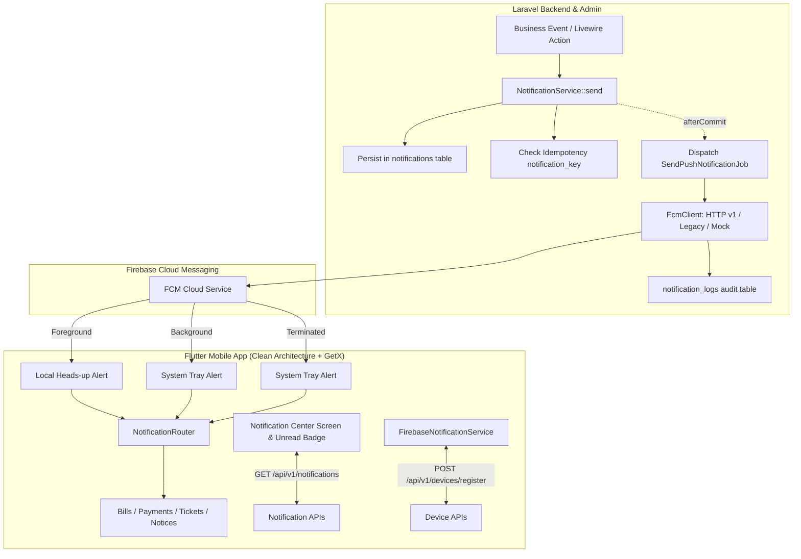

# Centralized API-Based Push Notification System Design

- **Date:** 2026-09-12
- **Authors:** Antigravity & User
- **Status:** Approved / In Review
- **Target Projects:**
  - **Laravel Backend & Admin:** `/Users/fazlerabbi/Desktop/Projects/tonmoy/build-utility-accounts-system`
  - **Flutter Mobile App:** `/Users/fazlerabbi/Desktop/Projects/building_utility_management_system`

---

## 1. Executive Summary & Objective

This specification details the architecture and implementation of a centralized, production-ready, API-based push notification system for the **Utility Accounts System (UAS)**.

The system empowers the Laravel backend to act as the single source of truth for all notifications. Business events (monthly bills generated, offline payments verified/rejected, notices published, maintenance requests updated, and administrative broadcasts) reliably generate persistent database records in an in-app notification center and dispatch push notifications through Firebase Cloud Messaging (FCM) to active resident devices.

### Non-Breaking Guarantee
The existing double-entry accounting core, live ledger balances, master data screens, and existing API contracts remain untouched and fully intact. Existing notification job invocations will be cleanly routed through the new centralized service with backward compatibility.

---

## 2. System Architecture



---

## 3. Database Schema & Models

### 3.1 `user_devices` Table
Tracks registered hardware devices and tokens for multi-device support per user.

| Column | Type | Attributes | Description |
| :--- | :--- | :--- | :--- |
| `id` | `bigint` | Primary Key, Auto-increment | Internal device record ID |
| `user_id` | `bigint` | Indexed, Foreign Key (`users.id`) `cascadeOnDelete` | Current device owner |
| `device_id` | `string(191)` | Unique Index | Hardware UUID / installation ID |
| `device_token` | `string(500)` | Indexed | FCM registration token |
| `platform` | `string(20)` | Default `'android'` | `'android'`, `'ios'`, or `'web'` |
| `device_model` | `string(100)` | Nullable | Hardware model (e.g. `'Pixel 9'`) |
| `os_version` | `string(50)` | Nullable | OS version string (e.g. `'15.0'`) |
| `app_version` | `string(50)` | Nullable | App version (e.g. `'1.0.0+1'`) |
| `is_active` | `boolean` | Default `true`, Indexed | Device notification readiness flag |
| `last_seen_at` | `timestamp` | Nullable | Last token sync or activity timestamp |
| `timestamps` | `timestamp` | Standard Laravel | `created_at`, `updated_at` |

**Single-Device Multi-Account Rule:**
A physical device has a unique `device_id`. When User A logs out, `is_active` becomes `false`. When User B logs in on that device, `user_id` is re-assigned to User B and `is_active` becomes `true`. User A will never receive User A's alerts on Device X after logout.

### 3.2 `notifications` Table
Stores notification history for the in-app notification center.

| Column | Type | Attributes | Description |
| :--- | :--- | :--- | :--- |
| `id` | `bigint` | Primary Key, Auto-increment | Notification ID |
| `user_id` | `bigint` | Indexed, Foreign Key (`users.id`) `cascadeOnDelete` | Target recipient |
| `type` | `string(50)` | Indexed | `NotificationType` enum string |
| `title` | `string(255)` | Not Null | Notification headline |
| `body` | `text` | Not Null | Notification message |
| `data` | `jsonb` | Nullable | Context payload (`screen`, `reference_id`, etc.) |
| `reference_type` | `string(50)` | Nullable, Indexed | Entity type (`'bill'`, `'payment'`, `'ticket'`, etc.) |
| `reference_id` | `bigint` | Nullable, Indexed | Entity primary key |
| `notification_key`| `string(191)`| Nullable, Unique Index | Event idempotency key |
| `is_read` | `boolean` | Default `false`, Indexed | Read state for notification center |
| `read_at` | `timestamp` | Nullable | Timestamp when read |
| `sent_at` | `timestamp` | Nullable | Timestamp when sent to queue/pushed |
| `status` | `string(20)` | Default `'pending'`, Indexed | `'pending'`, `'sent'`, `'failed'` |
| `timestamps` | `timestamp` | Standard Laravel | `created_at`, `updated_at` |

### 3.3 `notification_logs` Table
Audit trail of all push attempts per target device.

| Column | Type | Attributes | Description |
| :--- | :--- | :--- | :--- |
| `id` | `bigint` | Primary Key, Auto-increment | Audit log entry ID |
| `notification_id`| `bigint` | Indexed, Foreign Key (`notifications.id`) `cascadeOnDelete` | Parent notification |
| `user_id` | `bigint` | Indexed, Foreign Key (`users.id`) | Target user |
| `user_device_id` | `bigint` | Nullable, Foreign Key (`user_devices.id`) `nullOnDelete` | Target device |
| `status` | `string(20)` | Indexed | `'success'`, `'failed'`, `'invalid_token'`, `'skipped'` |
| `error_message` | `text` | Nullable | Sanitized error from FCM |
| `response_payload`| `jsonb` | Nullable | Raw FCM HTTP response data |
| `created_at` | `timestamp` | Indexed | Timestamp of attempt |

---

## 4. Backend Architecture & Components

### 4.1 `NotificationType` Enum (`app/Enums/NotificationType.php`)
```php
namespace App\Enums;

enum NotificationType: string
{
    case BillGenerated = 'BILL_GENERATED';
    case PaymentApproved = 'PAYMENT_APPROVED';
    case PaymentRejected = 'PAYMENT_REJECTED';
    case MaintenanceUpdated = 'MAINTENANCE_UPDATED';
    case NoticePublished = 'NOTICE_PUBLISHED';
    case AdminNotification = 'ADMIN_NOTIFICATION';
    case SystemBroadcast = 'SYSTEM_BROADCAST';
}
```

### 4.2 `NotificationService` (`app/Services/Notification/NotificationService.php`)
- **Signature:**
  ```php
  public function send(
      User|Collection|array $recipients,
      NotificationType $type,
      string $title,
      string $body,
      array $data = [],
      ?string $referenceType = null,
      ?int $referenceId = null,
      ?string $notificationKey = null
  ): Collection;
  ```
- **Idempotency:** Checks `notification_key`. If a notification with that key already exists, returns the existing record without duplicating DB entries or queue jobs.
- **Transaction Safety:** Creates database records, then invokes `SendPushNotificationJob::dispatch(...)->afterCommit()` so FCM push only fires after the database transaction succeeds.
- **Auditing:** Injects `AuditService` to log admin/system notification dispatches.

### 4.3 `FcmClient` (`app/Services/Notification/FcmClient.php`)
- **Multi-Mode Support:**
  1. **HTTP v1 (Modern)**: Generates OAuth2 Bearer token from service account credentials and posts to `https://fcm.googleapis.com/v1/projects/{projectId}/messages:send`.
  2. **Legacy Server Key**: Posts to `https://fcm.googleapis.com/fcm/send`.
  3. **Mock / Dry-Run**: When no credentials exist or during testing, safely logs to storage without failing tests or transactions.
- **Dead Token Pruning:** When FCM responds with `UNREGISTERED`, `NOT_FOUND`, `INVALID_ARGUMENT`, or HTTP 404/410, marks device `is_active = false`.

### 4.4 `SendPushNotificationJob` (`app/Jobs/SendPushNotificationJob.php`)
- Implements `ShouldQueue` with `tries = 3`, `backoff = [10, 30, 60]`.
- Receives notification ID(s) and target user ID(s).
- Resolves all active `user_devices` for target users.
- Dispatches FCM messages via `FcmClient` and records attempt outcomes in `notification_logs`.

---

## 5. REST API Specifications

All endpoints use Sanctum Bearer authentication and standard `ApiResponse` envelope:

| Method | Endpoint | Description |
| :--- | :--- | :--- |
| `POST` | `/api/v1/devices/register` | Registers or updates a device hardware ID & FCM token |
| `DELETE` | `/api/v1/devices/{device_id}` | Deactivates a device on logout |
| `GET` | `/api/v1/notifications` | Paginated notification history with `is_read` filter |
| `GET` | `/api/v1/notifications/unread-count`| Returns integer unread badge count |
| `PATCH` | `/api/v1/notifications/{id}/read` | Marks a single owned notification as read |
| `PATCH` | `/api/v1/notifications/read-all` | Marks all owned notifications as read |
| `POST` | `/api/v1/auth/fcm-token` | *(Backward-Compatible)* Proxies token to device register |

---

## 6. Web / Admin Notification Center

- **Livewire Component**: `App\Livewire\Admin\NotificationList`
- **Route**: `GET /admin/notifications`
- **Navigation**: Visible in `App\Support\Navigation.php` under Settings for Admin / Staff.
- **Key Capabilities**:
  - Filter by recipient, type, status, and read/unread.
  - Delivery log inspection modal showing device attempts, errors, and timestamps.
  - Manual notification broadcast modal targeting:
    - Single user
    - Specific role (`Owner`, `Tenant`, `Staff`)
    - All building residents

---

## 7. Flutter Mobile App Implementation (`building_utility_management_system`)

### 7.1 Configuration & Dependencies
- Add to `pubspec.yaml`:
  - `firebase_messaging: ^15.1.3`
  - `flutter_local_notifications: ^17.2.3`
- Android Manifest permissions: `POST_NOTIFICATIONS`, `VIBRATE`, `RECEIVE_BOOT_COMPLETED`.
- Notification channel: `uas_channel_alerts` ("Building Notifications").

### 7.2 Service Lifecycle (`FirebaseNotificationService`)
- Initialized in `lib/app/bootstrap.dart` via `Get.put(..., permanent: true)`.
- Requests OS notification permission on app startup without blocking.
- Syncs FCM token and hardware info on login via `POST /api/v1/devices/register`.
- Handles `FirebaseMessaging.instance.onTokenRefresh`.
- Deactivates device on logout via `DELETE /api/v1/devices/{device_id}`.

### 7.3 Notification Router (`NotificationRouter`)
Translates payload `screen` & `reference_id` to GetX tab changes or deep link screens:
- `bills` -> Bills Tab (Index 1)
- `payments` -> Payments Tab (Index 2)
- `maintenance` -> Maintenance Tab (Index 3)
- `notices` -> Notice details / board
- Fallback: Safely opens notification center if referenced entity is deleted or unavailable.

### 7.4 Notification Center Feature (`features/notifications`)
- **Entity & Model**: `NotificationEntity`, `NotificationModel`.
- **Repository**: `NotificationRepository` implementing API calls via `DioClient`.
- **Controller**: `NotificationController` with reactive `unreadCount`, `notifications` list, pagination, and mark-as-read actions.
- **Screen**: `NotificationsScreen` with pull-to-refresh, relative timestamps, type-based iconography, and mark-all-read action.
- **AppBar Badge**: Notification bell with reactive unread badge in `NavigationScreen`.

---

## 8. Business Event Integration Map

| Business Event | Trigger File | Action | Notification Type |
| :--- | :--- | :--- | :--- |
| **Monthly Bills Generated** | `app/Livewire/GenerateBills.php` | Bill calculation finalized | `BILL_GENERATED` |
| **Payment Submission Approved**| `app/Livewire/Billing/PaymentSubmissionList.php` | Admin approves slip | `PAYMENT_APPROVED` |
| **Payment Submission Rejected**| `app/Livewire/Billing/PaymentSubmissionList.php` | Admin enters rejection reason | `PAYMENT_REJECTED` |
| **Notice Published** | `app/Livewire/Masters/NoticeList.php` | Admin creates notice | `NOTICE_PUBLISHED` |
| **Maintenance Request Updated**| `app/Livewire/Admin/MaintenanceRequestList.php` | Status or staff assigned | `MAINTENANCE_UPDATED` |

---

## 9. Verification & Testing Plan

1. **Backend Unit & Feature Tests (`tests/Feature/Notification/...`)**:
   - Device registration with hardware details.
   - Device re-assignment when User B logs into Device X.
   - Token refresh updates existing device without duplicating rows.
   - Device deactivation on logout.
   - Notification creation, pagination, and unread count.
   - Ownership isolation (User A cannot read or mark User B's notification).
   - Idempotency key duplicate suppression.
   - Inactive device detection on FCM invalid token response.
2. **Web Admin Tests (`tests/Feature/Livewire/Admin/NotificationListTest.php`)**:
   - Access control (Admin/Staff only).
   - Notification history table rendering and filtering.
   - Manual push modal dispatch.
3. **Flutter Tests (`test/features/notifications/...`)**:
   - `NotificationModel` JSON serialization/deserialization.
   - `NotificationController` state management & unread badge count.
   - `NotificationRouter` navigation logic with valid and invalid payloads.
4. **Code Quality Gates**:
   - Laravel: `vendor/bin/pint --dirty --format agent`, `php artisan test`, `composer analyse`.
   - Flutter: `flutter test`, `flutter analyze`.
