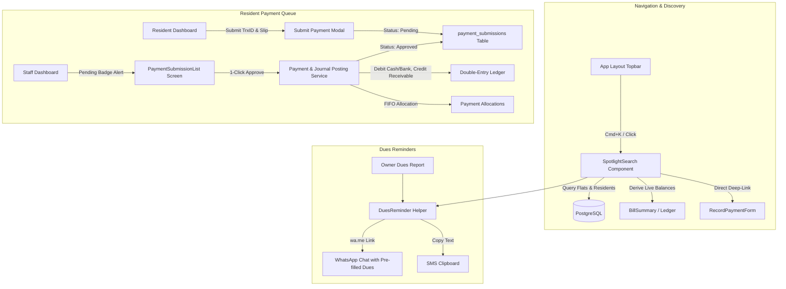

# Operator Command Center, Direct Reminders & Resident Payment Queue Implementation Plan

> **For agentic workers:** REQUIRED SUB-SKILL: Use superpowers:subagent-driven-development to implement this plan task-by-task. Steps use checkbox (`- [ ]`) syntax for tracking.

**Goal:** Provide an effortless management experience with a global `Cmd+K` Spotlight search palette, 1-click WhatsApp/SMS dues reminders with pre-filled balance and bill links, and a resident payment submission flow with 1-click accountant verification and auto-ledger posting.

**Architecture:** A global Livewire + Alpine palette (`SpotlightSearch`) provides instant keyboard-driven search across flats, residents, and navigation shortcuts. A localized `DuesReminder` service generates WhatsApp (`wa.me`) and SMS links with pre-filled dues. A new `PaymentSubmission` entity allows residents to submit bKash/Bank TrxIDs and payment slips, which accountants can verify and post into double-entry ledger transactions with one click.

**Architecture Diagram:**



**Tech Stack:** Laravel 13, PHP 8.5, PostgreSQL 18, Livewire 4, Alpine.js, Tailwind CSS, spatie/laravel-permission, PHPUnit 12.

## Global Constraints

- Balances are NEVER stored in static database columns; always derive via `BillSummary` or `JournalService`.
- Monetary calculations must use `bcadd`, `bcsub`, `bccomp` with scale 2.
- All searches and submissions must be strictly scoped to `CurrentBuilding`.
- Payment approvals must post a balanced double-entry journal entry (`SUM(debit) == SUM(credit)`) within a database transaction.
- UI styling must adhere to existing Tailwind 4 and `resources/views/components/ui/*` and `form/*` components.
- Run `vendor/bin/pint --format agent` and ensure `composer check` passes cleanly after every task.

---

### Task 1: 1-Click WhatsApp & SMS Dues Reminder Generator

**Files:**
- Create: `app/Support/DuesReminder.php`
- Create: `lang/en/reminders.php`
- Create: `lang/bn/reminders.php`
- Modify: `resources/views/livewire/reports/owner-dues.blade.php`
- Modify: `resources/views/livewire/flat-list.blade.php`
- Test: `tests/Unit/Support/DuesReminderTest.php`

**Interfaces:**
- Consumes: `Flat` model, owner phone number, and due amount string.
- Produces: `DuesReminder::for(Flat $flat, string $dueAmount): array` returning `whatsapp_url`, `sms_text`, `clean_phone`.

- [ ] **Step 1: Write the failing unit test for DuesReminder**
  - Verify phone number formatting (stripping spaces, brackets, hyphens, and leading zero to `880...`).
  - Verify message formatting in both English and Bengali.
  - Verify generation of valid `wa.me` encoded URLs.
- [ ] **Step 2: Run test to confirm failure**
  - Run: `php artisan test --compact tests/Unit/Support/DuesReminderTest.php`
- [ ] **Step 3: Implement `DuesReminder` service and language files**
  - Implement `app/Support/DuesReminder.php`.
  - Add bilingual templates in `lang/en/reminders.php` and `lang/bn/reminders.php`.
- [ ] **Step 4: Integrate WhatsApp and SMS buttons into Owner Dues and Flat List**
  - In `resources/views/livewire/reports/owner-dues.blade.php`: add a WhatsApp action icon for any flat with `total_due > 0`.
  - In `resources/views/livewire/flat-list.blade.php`: add reminder action in the action column.
- [ ] **Step 5: Run tests and verify**
  - Run: `php artisan test --compact tests/Unit/Support/DuesReminderTest.php`
  - Format with Pint: `vendor/bin/pint --format agent`
- [ ] **Step 6: Commit**
  - Git commit: `feat: add 1-click whatsapp and sms dues reminder generator`

---

### Task 2: Global Spotlight Search & Command Palette (`Cmd+K`)

**Files:**
- Create: `app/Livewire/SpotlightSearch.php`
- Create: `resources/views/livewire/spotlight-search.blade.php`
- Modify: `resources/views/components/layouts/app.blade.php`
- Test: `tests/Feature/SpotlightSearchTest.php`

**Interfaces:**
- Consumes: `CurrentBuilding`, `Flat`, `BillSummary`, and user role permissions.
- Produces: Livewire component for instant auto-complete search with keyboard shortcuts.

- [ ] **Step 1: Write the failing feature test for SpotlightSearch**
  - Test opening and closing the palette.
  - Test searching by flat number (e.g. "101", "2A"), owner name, and phone.
  - Test balance calculation badge (`overdue`, `clear`, `advance`).
  - Test building scoping (flats from another building are never returned).
  - Test role authorization (only authenticated staff can access staff commands).
- [ ] **Step 2: Run test to confirm failure**
  - Run: `php artisan test --compact tests/Feature/SpotlightSearchTest.php`
- [ ] **Step 3: Implement `SpotlightSearch` component and view**
  - Implement `app/Livewire/SpotlightSearch.php`: reactive query, debounced search, navigation shortcuts list.
  - Implement `resources/views/livewire/spotlight-search.blade.php`: modal with Alpine shortcut `@keydown.window.cmd.k.prevent="isOpen = true"`, `@keydown.window.ctrl.k.prevent="isOpen = true"`, arrow-key navigation.
- [ ] **Step 4: Mount `SpotlightSearch` in layout**
  - Update `resources/views/components/layouts/app.blade.php` to include `@auth <livewire:spotlight-search /> @endauth` and a search trigger button in the navbar.
- [ ] **Step 5: Run tests and Pint**
  - Run: `php artisan test --compact tests/Feature/SpotlightSearchTest.php`
  - Run: `vendor/bin/pint --format agent`
- [ ] **Step 6: Commit**
  - Git commit: `feat: add global spotlight search and command palette (Cmd+K)`

---

### Task 3: Payment Submission Database Schema, Model & Policy

**Files:**
- Create: `database/migrations/2026_09_10_010000_create_payment_submissions_table.php`
- Create: `app/Models/PaymentSubmission.php`
- Create: `database/factories/PaymentSubmissionFactory.php`
- Create: `app/Policies/PaymentSubmissionPolicy.php`
- Test: `tests/Feature/Billing/PaymentSubmissionModelTest.php`

- [ ] **Step 1: Write failing test for PaymentSubmission model and policy**
  - Test creating a payment submission for a flat.
  - Test policy: resident can view/create own submissions; staff can manage any in current building; other residents cannot view.
- [ ] **Step 2: Run test to confirm failure**
  - Run: `php artisan test --compact tests/Feature/Billing/PaymentSubmissionModelTest.php`
- [ ] **Step 3: Create migration and run migrate**
  - Create migration for `payment_submissions` table with foreign keys to `buildings`, `flats`, `users`, and nullable `payments`.
  - Run: `php artisan migrate`
- [ ] **Step 4: Create Model, Factory, and Policy**
  - Implement `PaymentSubmission.php` with casts, relationships, and scopes.
  - Implement `PaymentSubmissionFactory.php`.
  - Implement `PaymentSubmissionPolicy.php`.
- [ ] **Step 5: Run tests and Pint**
  - Run: `php artisan test --compact tests/Feature/Billing/PaymentSubmissionModelTest.php`
  - Run: `vendor/bin/pint --format agent`
- [ ] **Step 6: Commit**
  - Git commit: `feat: add payment_submissions schema, model, factory and policy`

---

### Task 4: Resident Dashboard Payment Submission Modal & History

**Files:**
- Modify: `app/Livewire/Dashboard.php`
- Modify: `resources/views/livewire/dashboard.blade.php`
- Test: `tests/Feature/Billing/ResidentPaymentSubmissionTest.php`

- [ ] **Step 1: Write failing test for resident submitting payment**
  - Test resident opening submission modal, filling amount, method (`bkash`), TrxID, and submitting.
  - Test asserting database has `payment_submissions` with status `pending`.
  - Test file attachment upload for deposit slips.
- [ ] **Step 2: Run test to confirm failure**
  - Run: `php artisan test --compact tests/Feature/Billing/ResidentPaymentSubmissionTest.php`
- [ ] **Step 3: Implement submission logic in `Dashboard.php`**
  - Add Livewire submission properties, validation rules, and `submitPayment()` method.
  - Add file upload support via `WithFileUploads`.
- [ ] **Step 4: Update resident dashboard view**
  - Add "Submit Payment" action button next to the total due card.
  - Render submission modal dialog.
  - Add "Recent Payment Submissions" tab / table showing pending verification status and TrxID.
- [ ] **Step 5: Run tests and Pint**
  - Run: `php artisan test --compact tests/Feature/Billing/ResidentPaymentSubmissionTest.php`
  - Run: `vendor/bin/pint --format agent`
- [ ] **Step 6: Commit**
  - Git commit: `feat: add resident payment submission modal and status tracking to dashboard`

---

### Task 5: Staff Payment Verification & 1-Click Double-Entry Posting

**Files:**
- Create: `app/Livewire/Billing/PaymentSubmissionList.php`
- Create: `resources/views/livewire/billing/payment-submission-list.blade.php`
- Modify: `routes/web.php`
- Modify: `app/Support/Navigation.php`
- Modify: `resources/views/livewire/dashboard.blade.php` (add staff alert counter widget)
- Test: `tests/Feature/Billing/StaffPaymentVerificationTest.php`

- [ ] **Step 1: Write failing feature test for staff verification**
  - Test accountant viewing pending submissions list.
  - Test accountant clicking "Approve":
    - Asserts `Payment` row created.
    - Asserts balanced `JournalEntry` posted (`debit == credit`).
    - Asserts `payment_allocations` created against unpaid bills.
    - Asserts submission status becomes `approved` and links to `payment_id`.
  - Test accountant clicking "Reject":
    - Asserts status becomes `rejected` with `rejection_reason`.
- [ ] **Step 2: Run test to confirm failure**
  - Run: `php artisan test --compact tests/Feature/Billing/StaffPaymentVerificationTest.php`
- [ ] **Step 3: Implement `PaymentSubmissionList` Livewire component**
  - Build list component with filters (`pending`, `approved`, `rejected`).
  - Implement `approve()` method wrapped in `DB::transaction()` using `JournalService`.
  - Implement `reject()` modal and method.
- [ ] **Step 4: Register route and navigation**
  - Add route `billing/submissions` in `routes/web.php` under `role:admin|accountant`.
  - Add to `Navigation.php` under Billing menu.
  - Add pending badge to Staff dashboard.
- [ ] **Step 5: Run full test suite and validation**
  - Run: `php artisan test --compact tests/Feature/Billing/StaffPaymentVerificationTest.php`
  - Run: `composer check`
- [ ] **Step 6: Commit**
  - Git commit: `feat: add staff payment submission verification and 1-click ledger posting`

---

## Verification Plan

### Automated Tests
```bash
# Unit test for dues reminder link generator
php artisan test --compact tests/Unit/Support/DuesReminderTest.php

# Feature test for global spotlight search
php artisan test --compact tests/Feature/SpotlightSearchTest.php

# Model and policy tests for payment submissions
php artisan test --compact tests/Feature/Billing/PaymentSubmissionModelTest.php

# Feature test for resident payment submission
php artisan test --compact tests/Feature/Billing/ResidentPaymentSubmissionTest.php

# Feature test for accountant 1-click verification and auto-journal posting
php artisan test --compact tests/Feature/Billing/StaffPaymentVerificationTest.php

# Pre-commit quality gate (Pint + Larastan + PHPUnit)
composer check
```

### Manual Verification
1. **Spotlight Search (`Cmd+K`):**
   - Press `Cmd+K` anywhere in the app; verify the search modal opens.
   - Type a flat number (e.g., `101`) or owner name; observe real-time balance badge (`Overdue`, `Advance`, or `Clear`).
   - Click "Collect Payment" and confirm it deep-links to `RecordPaymentForm` with the flat pre-selected.
2. **1-Click WhatsApp Reminder:**
   - Go to Owner Dues report; click the WhatsApp button on an overdue flat.
   - Confirm it opens `wa.me` with the owner's phone number and the pre-filled polite reminder message with exact BDT dues.
3. **Resident Payment Submission:**
   - Log in as a resident; on the dashboard click "Submit Payment".
   - Enter BDT 4,500, select `bKash`, input TrxID `9J2K4L`, and submit.
   - Confirm the submission appears with a yellow "Pending Verification" badge.
4. **Staff 1-Click Verification:**
   - Log in as admin/accountant; click the pending payments notification badge.
   - Click "Approve"; confirm that the submission is marked approved, a new Payment is recorded, and the resident's overdue balance drops immediately to zero on the ledger.
