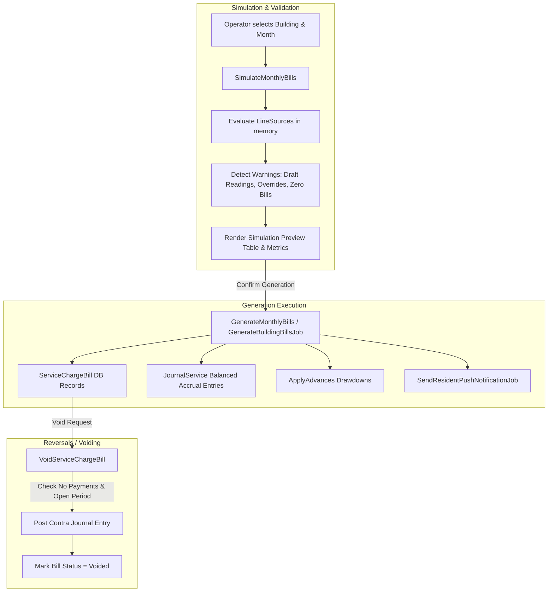

# Billing & Invoice Generation Engine Upgrade Implementation Plan

> **For agentic workers:** REQUIRED SUB-SKILL: Use `superpowers:subagent-driven-development` to implement this plan task-by-task. Steps use checkbox (`- [ ]`) syntax for tracking.

**Goal:** Enhance the Billing & Invoice Generation Engine with an in-memory Simulation / Dry-Run engine, anomaly/warning detection, safe contra-entry bill voiding, and queued batch generation with real-time UI progress.

**Architecture:** 
1. `SimulateMonthlyBills` computes line items, advance drawdowns, and warning flags in memory without DB writes or ledger mutations.
2. `VoidServiceChargeBill` provides a strict, accounting-compliant contra-journal reversal workflow for uncollected bills.
3. `GenerateBuildingBillsJob` encapsulates queued batch generation.
4. `GenerateBills` Livewire component provides an interactive simulation review screen with anomaly badges and summary metrics.

**Architecture Diagram:**


**Tech Stack:** PHP 8.5, Laravel 13, Livewire 4, PostgreSQL 18, Tailwind CSS 4, PHPUnit 12.

---

## Global Constraints

- Every financial mutation must post balanced journal entries through `JournalService` (`SUM(debit) == SUM(credit)`).
- Money arithmetic must use `bcadd`, `bcsub`, `bcmul`, `bcdiv`, `bccomp` with 2 decimal precision — never floats.
- Ledger lines must carry the `flat_id` dimension on `ServiceChargeReceivable` control accounts.
- Period lock must be strictly enforced: mutations and voidings are forbidden on closed accounting periods.
- Run `vendor/bin/pint --dirty --format agent` and `composer test` on every task.

---

## Tasks

### Task 1: Add `BillStatus::Voided` and `VoidServiceChargeBill` Service

**Files:**
- Modify: `app/Enums/BillStatus.php`
- Create: `app/Services/Billing/VoidServiceChargeBill.php`
- Create: `app/Exceptions/CannotVoidBillException.php`
- Test: `tests/Feature/Billing/VoidServiceChargeBillTest.php`

**Interfaces:**
- Consumes: `ServiceChargeBill`, `JournalService`, `AuditService`
- Produces: `VoidServiceChargeBill::handle(ServiceChargeBill $bill, string $reason, ?User $user = null): ServiceChargeBill`

- [ ] **Step 1: Write the failing test**
Create `tests/Feature/Billing/VoidServiceChargeBillTest.php` asserting that voiding an unpaid bill posts contra-journal entries, updates status to `Voided`, and blocks voiding if payments are allocated.

- [ ] **Step 2: Run test to verify it fails**
Run: `php artisan test tests/Feature/Billing/VoidServiceChargeBillTest.php`
Expected: FAIL (class/enum cases missing)

- [ ] **Step 3: Implement `BillStatus::Voided` and `VoidServiceChargeBill`**
Add `case Voided = 'voided'` to `app/Enums/BillStatus.php`. Implement `VoidServiceChargeBill` validating period status, ensuring `$bill->allocations()->doesntExist()`, building reversing journal lines, posting contra entry via `JournalService::post()`, and updating bill status.

- [ ] **Step 4: Run test to verify it passes**
Run: `php artisan test tests/Feature/Billing/VoidServiceChargeBillTest.php`
Expected: PASS

- [ ] **Step 5: Format and commit**
```bash
vendor/bin/pint --dirty --format agent
git add app/Enums/BillStatus.php app/Services/Billing/VoidServiceChargeBill.php app/Exceptions/CannotVoidBillException.php tests/Feature/Billing/VoidServiceChargeBillTest.php
git commit -m "feat(billing): add VoidServiceChargeBill service with contra-journal posting"
```

---

### Task 2: Implement `SimulateMonthlyBills` Dry-Run & Anomaly Detection Service

**Files:**
- Create: `app/Support/FlatBillSimulation.php`
- Create: `app/Support/BillSimulationResult.php`
- Create: `app/Services/Billing/SimulateMonthlyBills.php`
- Test: `tests/Feature/Billing/SimulateMonthlyBillsTest.php`

**Interfaces:**
- Consumes: `Building`, `Carbon $month`, registered `BillLineSource`s, `JournalService`
- Produces: `SimulateMonthlyBills::handle(Building $building, Carbon $month): BillSimulationResult`

- [ ] **Step 1: Write the failing test**
Create `tests/Feature/Billing/SimulateMonthlyBillsTest.php` verifying:
1. In-memory simulation matches exact amounts that `GenerateMonthlyBills` would bill.
2. Does NOT create any rows in `service_charge_bills` or `journal_entries`.
3. Detects anomalies: draft meter readings, zero amounts, already billed flats, and advances to be applied.

- [ ] **Step 2: Run test to verify it fails**
Run: `php artisan test tests/Feature/Billing/SimulateMonthlyBillsTest.php`
Expected: FAIL

- [ ] **Step 3: Implement Data Objects & `SimulateMonthlyBills`**
Implement `FlatBillSimulation` containing:
- `Flat $flat`
- `list<BillLineData> $lines`
- `string $totalAmount`
- `string $estimatedAdvanceDrawdown`
- `string $netReceivable`
- `list<string> $warnings` (e.g. `unconfirmed_meter_readings`, `draft_distributions`, `zero_amount`, `already_billed`, `fully_exempt`)

Implement `BillSimulationResult` aggregating flats, total estimated billing, total advances applicable, net receivable, and overall warnings.

- [ ] **Step 4: Run test to verify it passes**
Run: `php artisan test tests/Feature/Billing/SimulateMonthlyBillsTest.php`
Expected: PASS

- [ ] **Step 5: Format and commit**
```bash
vendor/bin/pint --dirty --format agent
git add app/Support/FlatBillSimulation.php app/Support/BillSimulationResult.php app/Services/Billing/SimulateMonthlyBills.php tests/Feature/Billing/SimulateMonthlyBillsTest.php
git commit -m "feat(billing): implement SimulateMonthlyBills dry-run and anomaly detection service"
```

---

### Task 3: Add `GenerateBuildingBillsJob` Queued Batch Generator

**Files:**
- Create: `app/Jobs/GenerateBuildingBillsJob.php`
- Test: `tests/Feature/Billing/GenerateBuildingBillsJobTest.php`

**Interfaces:**
- Consumes: `Building $building`, `Carbon $month`, `?int $dispatchedByUserId`
- Produces: Dispatches generation in queue worker, notifies residents upon completion.

- [ ] **Step 1: Write the failing test**
Create `tests/Feature/Billing/GenerateBuildingBillsJobTest.php` testing asynchronous execution, idempotency, and push notification dispatching.

- [ ] **Step 2: Run test to verify it fails**
Run: `php artisan test tests/Feature/Billing/GenerateBuildingBillsJobTest.php`
Expected: FAIL

- [ ] **Step 3: Implement `GenerateBuildingBillsJob`**
Implement job using `InteractsWithQueue`, `Queueable`, `SerializesModels`. Calls `GenerateMonthlyBills` in batch, handles notifications, and logs progress.

- [ ] **Step 4: Run test to verify it passes**
Run: `php artisan test tests/Feature/Billing/GenerateBuildingBillsJobTest.php`
Expected: PASS

- [ ] **Step 5: Format and commit**
```bash
vendor/bin/pint --dirty --format agent
git add app/Jobs/GenerateBuildingBillsJob.php tests/Feature/Billing/GenerateBuildingBillsJobTest.php
git commit -m "feat(billing): add GenerateBuildingBillsJob queued batch processing job"
```

---

### Task 4: Upgrade `GenerateBills` Livewire Screen with Simulation Table & Verification UI

**Files:**
- Modify: `app/Livewire/GenerateBills.php`
- Modify: `resources/views/livewire/generate-bills.blade.php`
- Modify: `lang/en/billing.php`
- Modify: `lang/bn/billing.php`
- Test: `tests/Feature/Livewire/GenerateBillsScreenTest.php`

**Interfaces:**
- Consumes: `SimulateMonthlyBills`, `GenerateMonthlyBills`, `GenerateBuildingBillsJob`
- Produces: Livewire interactive UI with real-time simulation preview, anomaly indicators, summary cards, and confirmation modal.

- [ ] **Step 1: Write the failing test**
Create `tests/Feature/Livewire/GenerateBillsScreenTest.php` verifying simulation triggering, tabular view of flat breakdown, warning filters, and confirmed generation.

- [ ] **Step 2: Run test to verify it fails**
Run: `php artisan test tests/Feature/Livewire/GenerateBillsScreenTest.php`
Expected: FAIL

- [ ] **Step 3: Implement Livewire Component & Blade Views**
Update `app/Livewire/GenerateBills.php`:
- Add `simulate()` action storing `BillSimulationResult`.
- Add search and warning filter properties (`search`, `warningFilter`).
- Update `generate()` to execute and refresh simulation state.

Update `resources/views/livewire/generate-bills.blade.php`:
- Add KPI summary cards: `Total Flats to Bill`, `Estimated Invoiced Total`, `Advances to Apply`, `Net Receivable`.
- Add interactive preview table showing each flat's lines, totals, advance drawdown, and warning badges (e.g. ⚠️ Unconfirmed Readings, ℹ️ Fully Exempt, ⚠️ Zero Amount).
- Add bilingual translations in `lang/en/billing.php` and `lang/bn/billing.php`.

- [ ] **Step 4: Run test to verify it passes**
Run: `php artisan test tests/Feature/Livewire/GenerateBillsScreenTest.php`
Expected: PASS

- [ ] **Step 5: Format and commit**
```bash
vendor/bin/pint --dirty --format agent
git add app/Livewire/GenerateBills.php resources/views/livewire/generate-bills.blade.php lang/en/billing.php lang/bn/billing.php tests/Feature/Livewire/GenerateBillsScreenTest.php
git commit -m "feat(billing): upgrade GenerateBills Livewire screen with dry-run simulation and preview"
```

---

### Task 5: End-to-End Verification & Pre-Commit Checks

- [ ] **Step 1: Run complete test suite**
Run: `composer test`
Expected: All tests pass.

- [ ] **Step 2: Run static analysis**
Run: `composer analyse`
Expected: Larastan passes with 0 errors.

- [ ] **Step 3: Run code formatting**
Run: `composer lint`
Expected: Pint passes.

- [ ] **Step 4: Run pre-commit gate**
Run: `composer check`
Expected: Real terminal confirmation that all checks pass.
