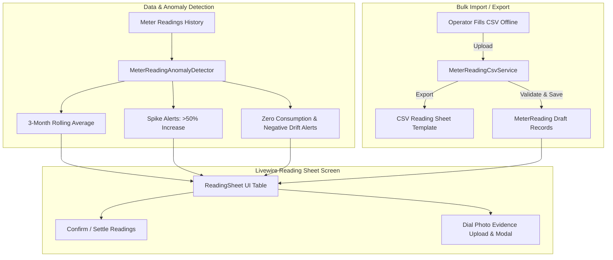

# Utility & Meter Reading Operations Upgrade Implementation Plan

> **For agentic workers:** REQUIRED SUB-SKILL: Use `superpowers:subagent-driven-development` to implement this plan task-by-task. Steps use checkbox (`- [ ]`) syntax for tracking.

**Goal:** Upgrade the Utility & Meter Reading module with bulk CSV/Excel template export & import, consumption spike/anomaly warnings (rolling 3-month average comparisons, negative usage alerts, zero usage on occupied units), and photo evidence attachments for meter dials.

**Architecture:**
1. `MeterReadingAnomalyDetector` computes rolling historical consumption averages and returns anomaly flags (`spike`, `negative_drift`, `zero_occupied`).
2. `MeterReadingCsvService` handles streaming CSV template export and validated bulk CSV imports.
3. `ReadingSheet` Livewire component integrates real-time anomaly badges, photo uploads, and CSV modal workflows.

**Architecture Diagram:**


**Tech Stack:** PHP 8.5, Laravel 13, Livewire 4, PostgreSQL 18, Tailwind CSS 4, PHPUnit 12.

---

## Global Constraints

- Never break existing double-entry accounting or tariff stamping invariants.
- Consumption calculations must use `MeterConsumption` service (`scale 3` arithmetic with `bcadd`/`bcsub`).
- Migrations must be non-destructive (`image_path` nullable on `meter_readings`).
- Maintain bilingual parity (`lang/en/utilities.php` and `lang/bn/utilities.php`).
- Pass `composer check` with 0 failures, 0 PHPStan errors, and 100% Pint formatting.

---

## Tasks

### Task 1: Migration for `image_path` & `MeterReadingAnomalyDetector` Service

**Files:**
- Create: `database/migrations/2026_09_14_000001_add_image_path_to_meter_readings_table.php`
- Modify: `app/Models/MeterReading.php`
- Create: `app/Services/Billing/MeterReadingAnomalyDetector.php`
- Create: `app/Support/MeterAnomalyData.php`
- Test: `tests/Feature/Billing/MeterReadingAnomalyDetectorTest.php`

**Interfaces:**
- Consumes: `Meter $meter`, `string $currentReading`, `Carbon $month`
- Produces: `MeterAnomalyData` (`averageConsumption`, `consumptionVariancePercentage`, `hasSpike`, `isNegative`, `isZeroOccupied`, `warningMessage`)

- [ ] **Step 1: Write the failing test**
Create `tests/Feature/Billing/MeterReadingAnomalyDetectorTest.php` testing 3-month average calculations, spike detection (>50% increase), and zero usage on occupied units.

- [ ] **Step 2: Run test to verify it fails**
Run: `php artisan test tests/Feature/Billing/MeterReadingAnomalyDetectorTest.php`

- [ ] **Step 3: Create migration & implement `MeterReadingAnomalyDetector`**
Run migration. Add `image_path` to `MeterReading::$fillable`. Implement `MeterReadingAnomalyDetector` using `MeterConsumption` and historical `MeterReading` queries.

- [ ] **Step 4: Run test to verify it passes**
Run: `php artisan test tests/Feature/Billing/MeterReadingAnomalyDetectorTest.php`

- [ ] **Step 5: Format and commit**
```bash
vendor/bin/pint --dirty --format agent
git add database/migrations/2026_09_14_000001_add_image_path_to_meter_readings_table.php app/Models/MeterReading.php app/Support/MeterAnomalyData.php app/Services/Billing/MeterReadingAnomalyDetector.php tests/Feature/Billing/MeterReadingAnomalyDetectorTest.php
git commit -m "feat(utilities): add meter image_path migration and MeterReadingAnomalyDetector service"
```

---

### Task 2: Implement CSV Template Export & Bulk Import Service

**Files:**
- Create: `app/Services/Billing/MeterReadingCsvService.php`
- Test: `tests/Feature/Billing/MeterReadingCsvServiceTest.php`

**Interfaces:**
- Consumes: `Building $building`, `Carbon $month`, `?int $utilityId`, `UploadedFile $file`
- Produces: `exportCsv(Building $building, Carbon $month, ?int $utilityId): string`, `importCsv(Building $building, Carbon $month, string $csvContent, ?int $userId = null): array{saved: int, skipped: int, errors: list<string>}`

- [ ] **Step 1: Write the failing test**
Create `tests/Feature/Billing/MeterReadingCsvServiceTest.php` testing CSV export header generation, reading population, and bulk importing with validation of digits/limits.

- [ ] **Step 2: Run test to verify it fails**
Run: `php artisan test tests/Feature/Billing/MeterReadingCsvServiceTest.php`

- [ ] **Step 3: Implement `MeterReadingCsvService`**
Implement CSV export generation and robust CSV line parsing with `str_getcsv`, checking for valid meter ownership, implausible readings, existing billed locks, and recording user stamps.

- [ ] **Step 4: Run test to verify it passes**
Run: `php artisan test tests/Feature/Billing/MeterReadingCsvServiceTest.php`

- [ ] **Step 5: Format and commit**
```bash
vendor/bin/pint --dirty --format agent
git add app/Services/Billing/MeterReadingCsvService.php tests/Feature/Billing/MeterReadingCsvServiceTest.php
git commit -m "feat(utilities): implement MeterReadingCsvService for bulk template export and import"
```

---

### Task 3: Upgrade `ReadingSheet` Livewire Screen & Blade UI

**Files:**
- Modify: `app/Livewire/Utilities/ReadingSheet.php`
- Modify: `resources/views/livewire/utilities/reading-sheet.blade.php`
- Modify: `lang/en/utilities.php`
- Modify: `lang/bn/utilities.php`
- Test: `tests/Feature/Utilities/ReadingSheetTest.php`

**Interfaces:**
- Consumes: `MeterReadingAnomalyDetector`, `MeterReadingCsvService`, `WithFileUploads`
- Produces: Livewire interactive UI with real-time spike indicators, CSV export action, CSV import modal, and photo thumbnail view.

- [ ] **Step 1: Write the failing test**
Update `tests/Feature/Utilities/ReadingSheetTest.php` testing CSV download response, CSV import workflow, and anomaly display.

- [ ] **Step 2: Run test to verify it fails**
Run: `php artisan test tests/Feature/Utilities/ReadingSheetTest.php`

- [ ] **Step 3: Implement component & view upgrades**
- Add Livewire `WithFileUploads` trait to `ReadingSheet.php`.
- Add `exportCsv()` streaming action and `importCsv()` modal action.
- Compute anomalies in `render()` and pass to blade view.
- Update `resources/views/livewire/utilities/reading-sheet.blade.php` with:
  - "Export CSV Template" button & "Import CSV" modal button.
  - Historical 3-month average badge per meter.
  - Live consumption spike warning badges (⚡ `+75% vs avg`, ⚠️ `Negative reading`, ℹ️ `0 usage (Occupied)`).
  - Dial photo attachment/preview button.
- Add translations in `lang/en/utilities.php` and `lang/bn/utilities.php`.

- [ ] **Step 4: Run test to verify it passes**
Run: `php artisan test tests/Feature/Utilities/ReadingSheetTest.php`

- [ ] **Step 5: Format and commit**
```bash
vendor/bin/pint --dirty --format agent
git add app/Livewire/Utilities/ReadingSheet.php resources/views/livewire/utilities/reading-sheet.blade.php lang/en/utilities.php lang/bn/utilities.php tests/Feature/Utilities/ReadingSheetTest.php
git commit -m "feat(utilities): upgrade ReadingSheet screen with bulk CSV operations and anomaly warnings"
```

---

### Task 4: End-to-End Verification & Pre-Commit Checks

- [ ] **Step 1: Run complete test suite**
Run: `composer test`
Expected: All tests pass.

- [ ] **Step 2: Run static analysis**
Run: `composer analyse`
Expected: Larastan passes with 0 errors.

- [ ] **Step 3: Run code formatting**
Run: `composer lint`
Expected: Pint passes.

- [ ] **Step 4: Run pre-commit gate**
Run: `composer check`
Expected: Real terminal confirmation that all checks pass.
